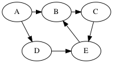
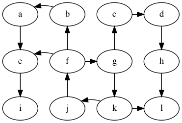
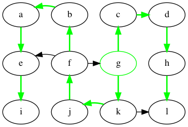
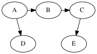

## Version 1 of the Breadth-First Search

```java "BFS v1"
static void BFS_v1(List<List<Integer>> G, int start, boolean[] visited,
				   int[] parent, int[] distance) {
	int k = 0;
	ArrayList<Integer> ends = new ArrayList<>();
	ends.add(start);
	parent[start] = start;
	visited[start] = true;
	distance[start] = 0;
	while (k != G.size()) {
		ArrayList<Integer> new_ends = new ArrayList<>();
		for (int u : ends) 
			for (int v : G.get(u))
				if (! visited[v]) {
				    distance[v] = distance[u] + 1;
					parent[v] = u;
					new_ends.add(v);
					visited[v] = true;
				}
		ends = new_ends;
		++k;
	}
}
```

Some observations about version 1:

* If the `new_ends` is empty at the end of the loop body,
  then we can stop early.

* The `ends` and `new_ends` can be combined into a single
  data structure if we use a queue instead of two bags.
  The front part of the queue represents `ends`
  and the back part of the queue represents `new_ends`.

With this change, we can simplify the code by combining the `while k`
and the `for u` loops into a single loop that checks whether the queue
is non-empty.

## Breadth First Search Algorithm

```java "BFS"
static void BFS(List<List<Integer>> G, int start, boolean[] visited,
				int[] parent, int[] distance) {
	Queue<Integer> Q = new LinkedList<Integer>();
	Q.add(start);
	visited[start] = true;
	distance[start] = 0;
	while (! Q.isEmpty()) {
		int u = Q.remove();
		for (int v : G.get(u))
			if (! visited[v]) {
				distance[v] = distance[u] + 1;
				parent[v] = u;
				Q.add(v);
				visited[v] = true;
			}
	}
}
```

straightforward analysis of the loops: O(n^2)
tighter bound: O(n + m)    (n is num vertices, m is num edges)

## **Student group work**: Example run of BFS




	queue       parents
	[A]         P[A] = A
	[B,D]       P[B] = A, P[D] = A
	[D,C]       P[C] = B
	[C,E]       P[E] = D
	[E]
	[]

Time complexity of BFS

* Main loop: we traverse the entire adjacency list graph
  once and the combined length of the adjacency lists is O(m),
  so we have O(m) for the main loop. 
* Initialization: O(n) time and space for the parent and done arrays.
* Total: O(n + m)


# Depth-first Search

This search chooses to go deeper at each step, following an out-edge
from the current vertex to a never-before-seen vertex. If there are no
out-edges to never-before-seen vertices, then the search backtracks to
the last visited vertex with out-edges to never-before-seen vertices
and continues from there.

Apply DFS on the following graph, starting at g.



Similar to BFS, DFS traverses a tree, a *depth-first tree*, which is
shown in green.



For generic search problems, that is, looking for a vertex with
a particular property, DFS and BFS both are good choices.

- BFS may require more storage if the graph has many high degree
  vertices because the queue gets big. 
- On the other hand, if the graph contains long paths, then DFS
  will use a lot of storage for it's stack.
- If there are infinitely long paths in the graph, then DFS
  may not be a good choice.

## **student group work**: perform DFS on the following graph


Solutions (there are multiple depth-first trees)




Are any of the DFS trees the same as a BFS tree for this graph?
Why not?

## **student group work**: implement DFS


```java "DFS"
static void DFS_visit(List<List<Integer>> G, int u, 
                int[]  parent, boolean[] visited, 
				ArrayList<Integer> finish) {
	visited[u] = true;
	for (int v : G.get(u)) {
		if (! visited[v]) {
			parent[v] = u;
			DFS_visit(G, v, parent, visited, finish);
		}
	}
    finish.add(u);
}

static List<Integer> DFS(List<List<Integer>> G) {
	int[] parent = new int[G.size()];
	boolean[] visited = new boolean[G.size()];
	for (int u = 0; u != G.size(); ++u) {
	  parent[u] = u;
	  visited[u] = false;
	}
    ArrayList<Integer> finish = new ArrayList<>();
	for (int u = 0; u != G.size(); ++u) {
		if (! visited[u])
			DFS_visit(G, u, parent, visited, finish);
	}
	return finish;
}
```
