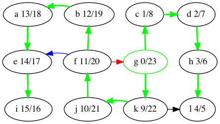
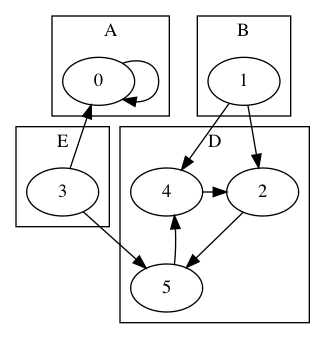
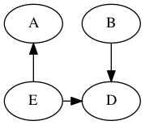
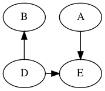

The DFS algorithm can compute the categories if we use a color scheme
to mark the vertices instead of just using a `done` flag.  The colors
are:
	
- white: the vertex has not been discovered
- gray: the vertex has been discovered but some of its descendents
  have not yet been discovered
- black: the vertex and all of its descendents have been discovered

During DFS, when considering an out-edge of the current vertex, the edge
can be categorized as follows:
- the target vertex is white: this is a tree edge
- the target vertex is gray: this is a back edge
- the target vertex is black: this could either be a forward or cross edge


We can discover yet more structure of the graph if we record
timestamps on a vertex when it is discovered (turned from white to
gray) and when it is finished (turned from gray to black).
This is useful when constructing other algorithms that use DFS, such
as topological sort. Here are the discover/finish times for the DFS
tree we computed above, shown again below.



**Theorem**
* If u → v is a tree, forward or cross edge, 
  then the finish_time[v] < finish_time[u].
* If u → v is a back edge, then finish_time[u] < finish_time[v].

What's the relationship between topological ordering and depth-first
search?

Let's look at the depth-first forest and discover/finish
times of the makefile DAG.


Here's the vertices ordered by finish time:

    f,d,a,b,e,c

That's the reverse of one of the topological orders:

    c,e,b,a,d,f 

Why is that? A vertex is finished *after* every vertex that depends
on it is finished. That's the same as topological ordering
except we've swapped *before* for *after*.


# Strongly Connected Components and Kosaraju's Algorithm

**Definition** A *strongly connected component* is a maximum subset of
the vertices in a graph such that every vertex in the subset is
reachable from all the other vertices in the subset.

For example, the following graph


has these strongly connected components:



**Definition** The transpose of a graph G, written G^T, has the same
vertices as G but the edges are reversed.


**Definition** The *component graph* C of another digraph G has
1) a vertex for each SCC in G. For each vertex u in C,
   we write SCC(u) for it's SCC in G.
2) an edge between u and v if there is an edge from
   any vertex in SCC(u) to any vertex in SCC(v).

Here is the component graph of the example.



**Theorem** A component graph is acyclic.

Otherwise, the vertices in the cycle represent connected components
that are not maximal. They could have been combined into a larger SCC.

## Kosaraju's Algorithm for SCC

Suppose we do a `DFS_visit` from a random node in the graph G.  We'll
visit all of the other nodes in its SCC (that's good) but we may also
visit nodes in other SCCs (that's bad).

How can we cause `DFS_visit` to stop before visiting nodes in other SCCs?

If we run `DFS_visit` on a node in an SCC that has no out-edges to
other SCCs, then we'd just visit the nodes in that SCC and no other.
We could then remove those nodes from the graph and repeat.

That's a lot like a topological ordering on the component graph C, but
with out-edges instead of in-edges. So what we need is a topological
ordering on the transposed component graph C^T.



For examaple, 

    D, B, A, E
	
is a topological ordering of C^T.

But we don't have C yet... that's what we're trying to compute!

Recall that DFS finish times are related to topological ordering. We
can apply `DFS` to G^T to obtain finish times. Here's the transposed
graph of the example with the root and edges of each DFS tree
highlighted in green.


and here are the vertices ordered by finish time:

    3, 0, 1, 5, 4, 2

The vertex that finished last (vertex 2) must be in a SCC (D) that
does not have any in-edges in C^T. Why is that? If there were an
in-edge from another SCC, then the source of that in-edge would have
finished earlier than vertex 2 (because 2 was last).  So that in edge
must be a back edge (recall the theorem about DFS finish times), but
then the two vertices would be in a cycle and in the same SCC, which
contradicts them being in different SCC.

Since the SCC (D) does not have any in-edges in C^T, it doesn't have
any out-edges in the C.

So running `DFS_visit` on vertex 2 in the original graph will only
reach other vertices in its SCC (D). `DFS_visit` will mark all of
those vertices as visited, so later runs of `DFS_visit` will ignore
them.

We continue running `DFS_visit` on each vertex according to the
reverse order of finish time (i.e. 4,5,1,0,3). Each tree in the
resulting DFS forest is a SCC.


So here's the algorithm

1. Transpose the graph G to obtain G^T.
2. Apply `DFS` to G^T to obtain the order in which the vertices finished.
3. For each vertex u in the reversed finish list, apply `DFS_visit` to u in G.
4. Each of the resulting DFS trees is a SCC.
   (The trees are encoded in the `parent` array.)

(The above differs from the standard presentation of Kosaraju's
algorithm, which instead applies `DFS` to G to get an ordering, and
then applies `DFS_visit` to G^T repeatedly to get the DFS forest in
which each tree is an SCC.)

```java "SCC"
static ArrayList<Integer> SCC(List<List<Integer>> G) {
  List<List<Integer>> GT = transpose(G);
  List<Integer> finished = DFS(GT);
  Collections.reverse(finished);

  ArrayList<Integer> parent = new ArrayList<>();
  ArrayList<Boolean> visited = new ArrayList<>();
  for (int u = 0; u != G.size(); ++u) {
    parent.add(u);
	visited.add(false);
  }
  ArrayList<Integer> ignore = new ArrayList<>();
  for (Integer u : finished) {
    if (! visited.get(u))
      DFS_visit(G, u, parent, visited, ignore);
  }
  return parent;
}
```

# Shortest Paths

We have seen the shortest path problem where each edge counts as
distance 1 and we used BFS to solve it. Now we consider graphs where
each edge has a real number for its *weight*.

Notation: We write w(u,v) or w(e) for the *weight* of an edge.

**Definition** The *weight of a path* is the sum of the weights of its
edges.  We also use the term *distance* for the weight of a path.
  
So for path p = e₁, e₂, ..., eᵣ

    w(p) = Σ{i∈1..r} w(eᵢ)

Motivation for the shortest path problem:
- internet packet routing
- driving routes
- minimizing flight duration

As with BFS, we'll focus on the single-source shortest-paths problem:
finding the shortest path from a source vertex to every other vertex
in the graph. Other alternatives are:
  
- Single-destination shortest-paths
- Single-pair shortest-path
- All-pairs shortest-paths

## Algorithm Preview

- Bellman-Ford: O(nm)
- Disjktra: 
	* using min-heap: O((n+m) log(n))
	* using Fibonnaci heap: O(n log(n) + m)
- DAG Shortest: O(n+m)      (uses topological sort)

Brute force: compute the length of every path

But this is exponential time: there are O(2^n) paths.
Here's a worst-case scenario.


## Shortest paths exhibit *optimal substructure*

That is, a subpath of a shortest path is a shortest path.

More precisely, if you have a shortest path

v₀ →ᵣ vᵢ →p vⱼ →q vk

then the subpath p

vᵢ →p vⱼ

is a shortest path from vᵢ to vⱼ.

Proof. Suppose vᵢ →p vⱼ is not a shortest path from vᵢ to vⱼ.
Then we splice the shortest path p' from vᵢ to vⱼ into
the path v₀ → vk to get

    v₀ →ᵣ vᵢ →p' vⱼ →q vk

which is a shorter path from v₀ to vk.
But that contradicts the assumption that

    v₀ →ᵣ vᵢ →p vⱼ →q vk

was a shortest path.

Take away: we can build shortest paths by growing them from smaller
shortest paths.

Notation: d(u,v) is the weight of the shortest path from u to v.
