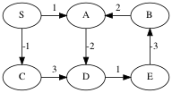
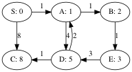

##  Negative-weight edges

Motivation: weak, not very common
    
Some shortest-path algorithms handle this (Bellman-ford), some do not
(Dijkstra, DAG Shortest Paths).
      
None of them handle graphs with negative-weight cycles, as the notion
of shortest-path doesn't make sense on such graphs.
        
Example:
        


The shortest path from S to C is -1.

The shortest path from S to A is undefined because you can keep going
around the cycle A → D → E → B, which has weight -2.
      
We can avoid negative weights in some situations by shifting weights up.


## Triangle Inequality

For all edges u → v, d(s,v) ≤ d(s,u) + w(u,v).

Proof: s → u → v is a path from s to v, and d(s,v) is the weight of
the shortest path.


## Relaxation

All of the algorithms rely on this technique.

We maintain a current best path length, an upper bound, on the
distance to a vertex.

We *relax an edge* by updating the distance of the target vertex if
this edge provides a shorter path to it.

```java "Relax"
static void relax(Edge e, double[] distance, int[] parent,
                  Map<Edge,Double> weight) {
    if (distance[e.target] > distance[e.source] + weight.get(e)) {
	    distance[e.target] = distance[e.source] + weight.get(e);
		parent[e.target] = e.source;
	}
}
```

## Bellman-Ford

The idea is to relax all the edges in the graph, over and over again.


Here's the graph initialized with distances


Suppose we relax the edges in this order: 

    (A,B), (A,D), (B,E), (D,A), (D,C), (E,D), (S,A), (S,C)

Most of the relaxations don't do anything, but the distances to A and
C get updated.


The next time around, the distances to B and D are updated.


The distance to E is updated on the next round.



Are we done yet? No, one more round updates the distance to C.


In the worst-case, how many times do we need to relax all the edges?

Answer: the length of the longest non-cyclic path in the graph, which
is bounded by the number of vertices.


```java "Initialize Distances and Parents"
double[] distance = new double[num_vertices];
int[] parent = new int[num_vertices];
for (int v = 0; v != num_vertices; ++v) {
    distance[v] = Double.MAX_VALUE;
	parent[v] = v;
}
distance[source] = 0.0;
```

```java "BellmanFord"
static boolean bellman_ford(List<Edge> edge_list, 
                            Map<Edge,Double> weight,
                            int source, int num_vertices) {
    <<<Initialize Distances and Parents>>>
	for (int i = 0; i != num_vertices; ++i) {
	    for (Edge e : edge_list) {
		    relax(e, distance, parent, weight);
		}
	}
	for (Edge e : edge_list) {
	    if (distance[e.target] > distance[e.source] + weight.get(e))
		    return false;
	}
	return true;
}
```

Time Complexity of Bellman-Ford

* initialization: O(n)
* relaxation loop: O(nm)
* negative cycle detection: O(m)
* Total: O(nm)


## Dijkstra Shortest Paths

Like BFS, the idea is to expand the wavefront of shortest-paths so far.

The challenge is to figure out how to explore paths in the order of
their weight. Consider the following graph with the source vertex S.


Growing the shortest paths tree in order of path weight:

            W=0   S

            W=1   S-->A


            W=2   S-->A-->B


            W=3   S-->A-->B
                          |
                          V
                          E

            W=5   S-->A-->B
                      |   |
                      V   V
                      D   E

            W=6   S-->A-->B
                      |   |
                      V   V
                  C<--D   E

Dijkstra's solution is to store all the potential next vertices (those
that are adjacent to the tree) in a priority queue ordered by their
distance as computed by the current tree plus the weight of the
lightest edge to that vertex.  Then the minimum of the priority queue
gives the next shortest path.

                   SPT                  Priority Queue
            W=0    S                    A:1, C:8

            W=1    S---A                B:2, D:5, C:8

            W=2    S---A---B            E:3, D:5, C:8

            W=3    S---A---B            D:5, C:8
                           |
                           |
                           E

            W=5    S---A---B            C:6  (decrease key!)
                       |   |
                       |   |
                       D   E

            W=6    S---A---B
                       |   |
                       |   |
                   C---D   E

**Student group work**: use Dijkstra's to compute the distances from S
to all the other vertices in the following graph.


        Answers:
    
               S: 0
               T: 8
               X: 9
               Y: 5
               Z: 7


Time Complexity of Dijkstra's Algorithm

 * n pushes to the queue: O(n log(n))
 * n pops from the queue: O(n log(n))
 * m `decrease_key` on the queue: O(m log(n))
 * Total: O((n+m) log(n))
