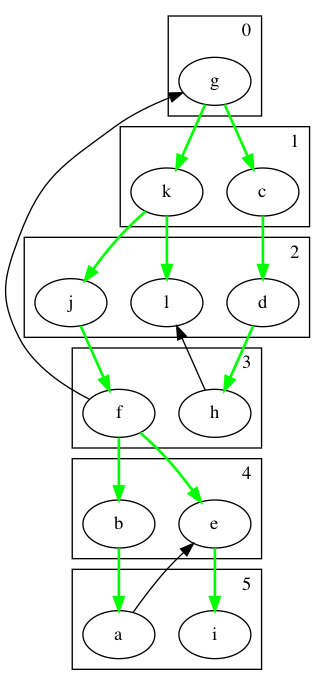

## Insert Tree Operation

This operation inserts a tree into a forest.

Example:

Insert tree
        
        o
        |
        o

into forest
        
        B(0) B(1) B(2)
        o    o    o
             |    |\
             o    o o
                  |
                  o

First we link the two B1's:
        
        o   o   o
        | ∪ | = |\
        o   o   o o
                |
                o
        
and we recursively insert the linked tree into the rest of the forest.
So we link the new B2 with the other B2 to get B3 (see above):

        1*B0 0*B1 0*B2 1*B3
		1    0    0    1
        
Time complexity: O(t)    where t is the number of trees in the forest.

  or O(log n)   where n is the number of elements in the forest 

## Amortized complexity of tree insertion

The amortized time complexity of inserting a tree is O(1), similar to
incrementing a binary counter.

Each tree in the forest is like a `1` in a binary number.  So we make
sure that each tree has 1 credit attached to it by doing the
following.

We charge 2 for each insertion of a tree into a forest. We use 1 unit
of this charge to place a credit on the inserted tree and we use the
other credit to carry out the insertion, as described below.

* If there is already a tree of the same height in the forest, then we
  link it with the tree to be inserted, consuming 1 credit from one of
  the trees, and transfer the credit from the other tree to the result
  of linking the trees. We then recursively insert the linked tree into the
  rest of the forest.
	  
* If there is not a tree of the same height, then we update the forest
  to include the new tree, consuming 1 unit.

## Merge Operation

The merge function takes two binomial forests, ordered by increasing
height, and turns them into a single forest.  This algorithm is
analogous to addition on binary numbers.

Examples:
        
merge {B0,B2} with {B1,B4} = {B0,B1,B2,B4}
		
merge {B0, B1} with {B1, B4} = {B0, B2, B4}

Time complexity: O(t)     where t is number of trees in both forests

In a binomial queue with n elements, t = log n.

Time complexity: O(log n)

## Extract Max Operation

1. In the forest, find the tree with the largest key. O(log n)

2. Remove that tree, but merge all of its children into the
   forest. O(log n)
   This requires reversing the children so that they are
   ordered by increasing height. O(log n)

{B0, B2, B3, B4}

  suppose B2 has the largest key

 merge {B0, B3, B4}  {B0,B1} (children of B2)
    B0+B0 = B1
	B1+B1 = B2
	{B2, B3, B4}

Time complexity: O(log n)

## Maximum Operation

**Student exercise**

# Graph Data Structure

The standard mathematical way to represent a graph G is with a set of
vertices V and a set of edges E, that is, G = (V,E).

In a *directed graph*, each edge is a pair of vertices where the first
vertex is called the source and the second is the target.

In an *undirected graph*, each edge is a set containing two distinct
vertices.
    
I often use n for the number of vertices and m for the number of
edges.

The set of vertices for this graph is {0,1,2,3,4,5}.
    
The set of edges is 
{(0,0), (1,2),(1,4),  (2,5),  (3,5),(3,0),  (4,2),  (5,4),  }.

Given edge (u,v) in a directed graph, we say v is *adjacent* to u.  We
sometimes write u → v for the edge (u,v).
    
The edge (u,v) is an *out-edge* of u and an *in-edge* of v.
    
The *out-degree* of a vertex is the number of its out-edges.
    
The *in-degree* of a vertex is the number of its in-edges.

The set of vertices is {0,1,2,3,4}.
   
The set of edges is {{1,2},{1,0},  {2,3},{2,4},{2,0},  {3,4},  {4,0}}.
      
We often writes an undirected edge as (1,2) or 1-2 instead of {1,2}.

Given edge {u,v} in an undirected graph, we say u and v are
*adjacent* to each other. 
    
We say that edge {u,v} is *incident on* vertex u and v.
    
The *degree* of a vertex is the number of edges incident on it.

## The *Adjacency List* representation of a graph

An array of linked lists.

Example: for the above directed graph the adjacency list
representation is

         |0| -> 0
         |1| -> 2 -> 4
         |2| -> 5
         |3| -> 0 -> 5
         |4| -> 2
         |5| -> 4
    
Example: for the above undirected graph the adjacency list
representation is

         |0| -> 1 -> 2 -> 4
         |1| -> 0 -> 2
         |2| -> 1 -> 4 -> 3 -> 0
         |3| -> 2 -> 4
         |4| -> 0 -> 3 -> 2

(Each edge is stored twice.)

Adjacency lists are good for storing sparse graphs.
    
* Space: O(n + m).
* Edge detection given two vertices: O(n)
* Edge insert: O(1)
* Edge removal given two vertices: O(n) 
* Edge remove given edge handle: O(1) if use double linked
* Edge removal: O(n) or O(1) if use double linked and edge handle
* Vertex insert: amortized O(1) using table doubling
* Vertex delete: not easily supported
* Visit the out-edges (adjacent) of a vertex: O(n)
   but, on average O(1) for a sparse graph.

## The *Adjacency Matrix* representation of a graph

A Boolean matrix.

Example, for the directed graph above.

          0 1 2 3 4 5
        0 1 0 0 0 0 0
        1 0 0 1 0 1 0
        2 0 0 0 0 0 1
        3 1 0 0 0 0 1
        4 0 0 1 0 0 0
        5 0 0 0 0 1 0

Example, for the undirected graph above.

          0 1 2 3 4
        0 0 1 1 0 1
        1 1 0 1 0 0
        2 1 1 0 1 1
        3 0 0 1 0 1
        4 1 0 1 1 0
    
Note that the matrix is symmetric.

Adjacency matrices are good for dense graphs.
      
* Space: O(n²)
* Edge detection given two vertices: O(1)
* Edge insert: O(1)
* Edge removal given two vertices: O(1)
* Edge remove given edge handle: O(1)
* Edge removal: O(1)
* Vertex insert: amortized O(1) table doubling
* Vertex delete: not easily supported
* Visit the out-edges (adjacent) of a vertex: O(n)

How could we represent Adjacency Matrices in Java?

# Breadth-First Search

**Definition** a *path* is a sequence of vertices v₀,...,vⱼ such that
there is an edge between every vertex and the next one in the
sequence (except for the last), i.e., vᵢ → vᵢ₊₁ ∈ E for i=0... j-1. 

The *length* of a path is the number of edges in the path.

A path forms a *cycle* if it starts and ends at the same vertex.

We sometimes abbreviate a path to v₀ → vⱼ.
Also, when talking about multiple different paths, we might
use a subscript to give the path a name, such as v₀ →ᵤ vⱼ.

Problem: compute the shortest paths from vertex g to all other
vertices in the graph.

Example: what is a shortest path from g to f?

Possible solution: g → k → j → f, length 3.

To prove this is really the shortest, we need to make sure there are
no paths of length less-than 3 from g to f.

How do we prove that? Well, look at all paths of length less-than 3
that start from g.

Length 0 paths:

    g

Length 1 paths:

    g → c

    g → k

Length 2 paths:

    g → c → d

    g → k → l

    g → k → j

Good, none of the paths from g with length less-than 3 reach f.

So indeed, g → k → j → f is the shortest path from g to f.

Towards a general algorithm for BFS, can we compute all the k+1 length
shortests paths given all the k-length shortest paths?

Draw a picture of the wave-front of the k-length
shortest paths and the out-edges on the wave-front.

High-level Algorithm:

	for k = 0...n
	  for each path s ~>^k u:
		for each edge {u,v} incident to u:
		  If we don't already have a shortest-path to v, 
		  then s ~>^{k+1} u is a shortest path from s to v.

What data structures should we use?

* The shortest paths form a **tree**:
  for each vertex v, store the previous vertex u in its shortest path.
  we call u the "parent" of v because u is the parent of v in
  the tree of shortest paths. This is also called the 
  **breadth-first tree**.

* For the paths of length k:
  We just need the end vertex of each path, so let's maintain a **bag**
  of the vertices at the ends of the paths of length k.

* To make sure we ignore vertices that have already been encountered,
  we use an **array** called `visited` that maps vertex numbers to
  true/false.
