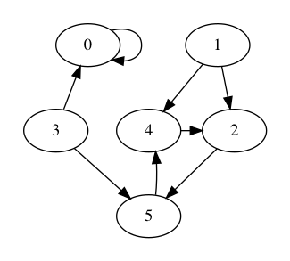
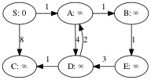
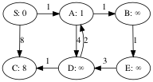

# Note to self

To generate the `Makefile` and all the code from this file,
run the following command.
    	
	~/bin/lmt lecture-notes.md
    
If you need to install `lmt`, get the fork from dabrahams on github
and build with `go build main.go`, rename `main` to `lmt`, and put it
in your `bin` directory.

# Lecture: Course Introduction

Course Canvas page: 

    https://iu.instructure.com/courses/1946118

## Introductions

* Jeremy Siek
* Chao-Hong Chen

## Goals

Learn how to

* create algorithms
  to solve computational problems and
  implement them in Java

* analyze algorithms
  How much time?
  How much space?

## How to succeed in this course

Attend the lectures and ask questions, either on Zoom
  or you can also post your question on Slack.
  If you like someone else's question, give it a thumbs up.

Read the assigned chapters from the textbook.
(On Canvas, scroll down to the Schedule of Topics.)
Complete the assigned exercises.

There will be overlap between the textbook and the lecture. 
That is good.
Humans learn through repetition.

Attend the labs and complete the programming assignments.  When you
get stuck, ask for help! Talk to your classmates, Chao-Hong, and me.

Test your code thoroughly.

Use a debugger to find bugs and improve your understanding of Java.

IntelliJ IDE Community Edition (CE), JetBrains


## Structure of the course

Weekly programming assignment to implement an algorithm. 
Submit to the autograder:
  
        https://autograder.sice.indiana.edu/web/course/20

Homework exercises every few weeks.
Submit on Canvas.

Quiz every two weeks (on Canvas).

Midterm exam as a Canvas quiz in week 8.

Final exam as a Canvas quiz in the last week.

The programming assignments and exercises can be done collaboratively
but every student must turn in the assignment.

The quizzes and exams are to be done individually, without any aids
(closed book), and will be proctored using Respondus Monitor.

## Grading

* Assignments and exercises: 20%
* Quizzes: 20%
* Midterm exam: 30%
* Final exam: 30%


## Resources

* Zoom for lectures. (Also in-person outdoors later in Spring.)

* Slack for questions and discussion.

* IntelliJ for developing Java programs.

* Textbook: Introduction to Algorithms 3rd Ed. (CLRS)


## What is an algorithm?

A detailed recipe for solving a computational problem.

A *computational problem* is a question about data of a specified form.
For example, what is the minimum number in an array of integers?

An *instance* of a problem is actual data of the specified form. 
For example, the array `[4,3,7,2,9]`.

Given any instance of the problem, the recipe must:
1. always finish 
2. each step in the recipe must be precisely defined
  and only take a finite amount of time
  (so a person or computer could do it)
3. produce output that answers the question

We refer to 1. as "termination" and 3. as "correctness".

The author of an algorithm must give a precise argument that explains
why the algorithm always terminates.

Similarly, the author must give an argument for why it always returns
a correct answer.


## Example computational problems

* Human genome sequence assembly
* Shortest distances among destinations (google map)
* Analyzing social networks
* Internet search 
* Scheduling of manufacturing tasks & supply chain.


## Algorithm Analysis

There are often multiple algorithms for the same problem.

Which one is the best? That is, which one takes the least amount of
time and/or space?

Complication: the amount of time and space used by an algorithm often
depends on the input data. 

We usual focus on the worst-case scenario and come up with a function
of input size to time.

Furthermore, we only care about large differences in time as the input
size grows, so we study the asymptotic behavior of the functions and
ignore constant factors.

Let `n` be the size of the input and `T(n)` be the worse-case time.

* logarithmic:

        T(n) = log(n)
        T(n) = 2 log(n) + 5
        
* linear: 

        T(n) = n + 20
        T(n) = 1.5 n
        T(n) = 3 n + 2
        T(n) = 20 n

* quadratic

        T(n) = n^2 + n + 100
        T(n) = 10 n^2

* exponential

        T(n) = 2^n
        T(n) = 3^n


# Minimum Number Problem

## Problem

Given a non-empty array of numbers, which number is the smallest?

## Algorithm

Scan through all the elements from left to right and keep track of
which one is the smallest so-far.

    static public int minimum(int A[]) {
        assert(0 < A.length);
        int min = A[0];
        int i = 1;
        while (i != A.length) {
            // min is smallest in [0,i) of array A
            if (A[i] < min) {
                min = A[i];
            }
            // min is smallest in [0,i+1) of array A
            i = i + 1;
            // min is smallest in [0,i) of array A
        }
        // min is smallest in [0,A.length) of array A
        return min;
    }


## Student Group Activity:  alternative algorithms (5 minutes)

Login to Google Drive with your IU account and go to the Google
document given in today's announcement on our Canvas page.

Share your name and where you are from with the other students
in your group. Choose a person to record your answers.

Think of a different algorithm for computing the minimum number in an
array? Is it faster or slower than the `minimum` function?

## Running `minimum`

Run the `MinTwo` test in the IntelliJ debugger.

Empirical approach to correctness and runtime analysis:

1. Run `minimum` on many different inputs that cause all
   branches to be taken.

2. Plot the execution time versus input size for many
   inputs of different size.


## Proof of correctness

The invariant of the `while` loop is that `min` is the smallest
element in the range `[0,i)`.  To be clear, by smallest element we
mean an element that is less-than-or-equal every element in the range.

We often work with half-open intervals like `[0,i)`. Recall that they
include the left endpoint but not the right endpoint.

To gain confidence in this invariant, we can write a method to check
the invariant and insert a call to it at the top of the loop.

    static public Boolean is_minimum(int min, int A[], int begin, int end) {
        for (int i = begin; i != end; ++i) {
            if (min > A[i]) return false;
        }
        return true;
    }

    static public int minimum(int A[]) throws Exception {
        ...
        while (i != A.length) {
            assert(is_minimum(min, A, 0, i));
            if (A[i] < min) {
        ...
    }

Recipe for proving that a loop satisfies a loop invariant.
1. Prove that the loop invariant is true just before the loop.
2. For some hypothetical iteration of the loop, 
   prove that the loop invariant is true at the bottom of the loop
   assuming that it started out true at the beginning of the loop.

Once you have shown that a loop satisfies an invariant, you can reason
about what comes after the loop, using the loop invariant and the
negation of the loop's condition.

Let's apply this to the `minimum` algorithm.

1. Just before the loop, `min` is the smallest element in `[0,1)`
  because it is the only element in that range.

2. Now consider a hypothetical iteration of the loop.

  We may assume that `min` is the smallest element in `[0,i)`
  at the start of the loop. We need to show that this remains
  true at the end of the loop.
  We consider two cases.
  a. `A[i] < min`
     So `min` is changed to `A[i]`. This new value of `min`
     is equal to `A[i]` and less-or-equal the elements in `[0,i)`,
     so `min` is the smallest element in `[0,i+1)`.
     At the end of the loop, `i` is changed to `i+1`, 
     at which point `min` is the smallest element in `[0,i)`.
  b. `min <= A[i]`
     So `min` is the smallest element in `[0,i+1)`.
     At the end of the loop, `i` is changed to `i+1`, 
     at which point `min` is the smallest element in `[0,i)`.

After the loop is finished, we know that `i == A.length` and that
`min` is the smallest element in `[0,i)`.  So `min` is the smallest
element in `A`.

## Runtime analysis

Let n be the length of the array.

As a proxy for actual times, we'll count how many non-trivial lines of
code get executed. There are 4 lines of code in the `while` loop and 3
lines of code outside the loop. The loop executes n - 1 times.

    T(n) = 4(n - 1) + 3 = 4n - 1

    is an upper bound on the time this function takes.

# Covering A Grid with Dominos

Suppose you have a rectangular grid with dimensions 2 x n.

| | | | | |
|-|-|-|-|-|
| | | | | |

How many ways are there to cover the grid with n dominos,
where a domino is allowed to be placed vertically (V):

| |
|-|
|■|

or horizontally (H):

| |■|
|-|-|

n=1. One way:

| |
|-|
|■|

 V

n=2. Two ways:

| | |
|-|-|
|■|■|

 VV
 
| |■|
|-|-|
| |■|

 HH
 
 HV
 
| |■| |
|-|-|-|
| | |■|

n=3. Three ways:

| | | |
|-|-|-|
|■|■|■|

 VVV

| |■| |
|-|-|-|
| |■|■|

 HHV

| | |■|
|-|-|-|
|■| |■|

 VHH

for last move:
* vertical domino
   C(n-1)  columns left
* two horizontal dominos
   C(n-2)

C(n) =
  if (n == 1)
     return 1
  else if (n == 2)
     return 2
  else
     C(n-1) + C(n-2)

n=4. How many ways?


How about for larger n?


Answer: 

Let C(n) be the number of ways to cover the grid.

C(1) = 1
C(2) = 2
C(n) = C(n-1) + C(n-2)       if n > 2

1,2,3,5,8,13,21,34,55,89,...

These are Fibonacci numbers!


# Fibonacci numbers

The Fibonacci numbers just start a bit lower.

    F(0) = 0
    F(1) = 1
    F(n) = F(n-1) + F(n-2)       if n > 1

0,1,1,2,3,5,8,13,21,34,55,89,...

They grow rapidly!

    2^(n/2) <= F(n)     for n >= 6.


## Naive Algorithm

Directly inspired by the definition.

    static int fib(int n) {
        if (n < 2) {
          return n;
        } else {
          return fib(n - 2) + fib(n - 1);
        }
    }

(Caveat: `int` is a 64 bit integer, so it can only handle inputs up to
n=46. If you needed to handle larger inputs, you'd need to use a
big-integer library.)

analysis of time:

    T_fib(n) = { 2                              if n < 2
               { 2 + T_fib(n-1) + T_fib(n-2)    if n >= 2

That's like the Fibonacci numbers themselves. It grows very fast!

But there is a lot of repetition and wasted work.


                     ________F(5)_______
                    /                   \
               ___F(4)____              F(3)
              /           \            /   \
            F(3)          F(2)        F(2)  F(1)
          /      \       /   \       /  \
        F(2)     F(1)  F(0)   F(1)  F(0) F(1)
       /   \
    F(0)   F(1)


## A More Efficient Algorithm

Compute the sequence up to the one you want, storing it in an array.

    static int fib_array(int n) {
        int F[] = new int[n + 2];
        F[0] = 0;
        F[1] = 1;
        int i = 2;
        while (i <= n) {
            F[i] = F[i-1] + F[i-2];
            i = i + 1;
        }
        return F[n];
    }

Time:

    static int fib_array(int n) {        // Time:
        int F[] = new int[n + 2];        // n + 2
        F[0] = 0;                        // 1
        F[1] = 1;                        // 1
        int i = 2;                       // 1
        while (i <= n) {                 // 1*(n-2)
            F[i] = F[i-1] + F[i-2];      // 1*(n-2)
            i = i + 1;                   // 1*(n-2)
        }
        return F[n];                     // 1
    }

    T(n) = 4n + 6

How much space is used?

    S(n) = n + 2

Can you do better? That is the topic of this week's lab.


# Growth of Functions

Analyzing the exact time an algorithm takes to run is brittle and
messy. It is brittle because the time can change every year due to
changes in computers. It is messy, mathematically, because the time
depends on every branch of the code and often depends on the data.

We solve both problems by developing a method that 

1. suppresses constant factors, and
2. compares the functions as the input grows towards infinity.


## Big O

**Definition** Suppose g is a function. O(g) is the set of all
functions that grow at the same rate or slower than g.
To be precise, for some function f, we have
f ∈ O(g)
iff
there exists numbers n₀ and c such that
for all n ≥ n₀, 0 ≤ f(n) ≤ c g(n).

We say that g is an *asympototic upper bound* for f.
(Or just "upper bound" for short.)

first_three_odds =  {1,3,5}
odds = {1,3,5,7,9,...}

O(n²) = {n², 2n², 0.5 n², n, 2n, 1, 2n² + 3n + 5, ... }

n^3 ∈ O(n²)? No, that's false.

### Example: 2n² + 3n + 5 ∈ O(n²)

We need to find the constants n₀ and c.

We need 
2n² + 3n + 5 ≤ c n²
choose c = 4 because 4 is larger than 2, the coefficient on n².
2n² + 3n + 5 ≤ 4n²
but that's not true when n=0!
5 ≤ 0
Ok, so we need to choose a larger n₀.

n | 2n² + 3n + 5 | 4n²
--|--------------|----
0 | 5            | 0
1 | 10           | 4
2 | 19           | 16
3 | 32           | 36
4 | 49           | 64

Choose n₀ = 3.
for all n ≥ 3, 2n² + 3n + 5 ≤ 4n².      ✓

solving the inequality:
(2n² + 3n + 5)/n² ≤ c n² / n²
2 + 3/n + 5/n² ≤ c            when n grows large
2 < c


Example of f not in O(n^2)?

n^3 not in O(n^2)

n^3 ≤ c n^2

n^3 / n^2 ≤ c n^2 / n^2
n ≤ c   false!


### f ≾ g notation for Big-O

**Definition** We write f ≾ g to mean f ∈ O(g).

This relation is a preorder:
* reflexive: f ≾ f for any f.
* transitive: If f ≾ g and g ≾ h, then f ≾ h, for any f, g, h.

This relation is not anti-symmetric. 
(Anti-symmetry: If a ≤ b and b ≤ a, then a = b.)
For example, above we showed that
2n² + 3n + 5 ≾ n²
It's also true that
n² ≾ 2n² + 3n + 5.
but of course, 2n² + 3n + 5 ≠ n².


## Big-Omega

**Definition** Suppose g is a function. Ω(g) is the set of all
functions that grow at the same rate or greater than g.
To be precise, for some function f, we have
f ∈ Ω(g)
iff
there exists numbers n₀ and c such that
for all n ≥ n₀, 0 ≤ c g(n) ≤ f(n).

We say that g is an *asympototic lower bound* for f.
(Or just "lower bound" for short.)

**Definition** We write f ≳ g to mean f ∈ Ω(g).

This relation is also a preorder.

Big-O and Big-Omega are opposites (transpose symmetry):

    f ≾ g iff g ≳ f

## Big Theta

**Definition** Suppose g is a function. Θ(g) is the set of all
functions that grow at the same rate as g.
So, for some function f, we have
f ∈ Θ(g)
iff
there exists numbers n₀, c1, c2 such that
for all n ≥ n₀, 0 ≤ c1 g(n) ≤ f(n) ≤ c2 g(n).

So f is sandwiched between g multiplied by a small constant and g
multiplied by a big constant.

We say that g is an *asympototic tight bound* for f.
(Or just "tight bound" for short.)

**Definition** We write f ≍ g to mean f ∈ Θ(g).

This relation is an equivalence relation.
* reflexive: f ≍ f for any f.
* symmetric: If f ≍ g, then g ≍ f for any f and g.
* transitive: If f ≍ g and g ≍ h, then f ≍ h, for any f, g, h.

Big-Theta is related to big-O and big-Omega as you would expect

    f ≍ g iff f ≾ g and g ≾ f.

For each equivalence class of this relation, we pick out the simplest
function to be the representative. Here are some of them ordered from
small to large:

    1  ≾  log n  ≾  √n  ≾  n  ≾  n log n  ≾  n²  ≾  2ⁿ


## Aside: combining functions, combining big-O

**Definition** Pointwise addition:

    (f + g)(x) = f(x) + g(x)
  
**Definition** Pointwise multiplication:

    (f × g)(x) = f(x) × g(x)

**Definition** Addition of big-O:

    O(f) + O(g) = { h | h ≾ f + g }

**Definition** Multiplication of big-O:

    O(f) × O(g) = { h | h ≾ f × g }


## Properties of Big-O

Ignore constants: c n² ∈ O(n²)

Ignore terms of polynomial with smaller exponents: n² + 2n ∈ O(n²)

For pointwise-addition, take the larger, for example:
  If f ∈ O(n), g ∈ O(n²), then f + g ∈ O(n²).
In other words, if f ≾ g then
* O(f) + O(g) = O(g)

Example: O(log n) + O(n) = O(n).

For pointwise-multiplication, multiply, for example:
  If f ∈ O(n), g ∈ O(n²), then f × g ∈ O(n³).
In other words
* O(f) × O(g) = O(f × g)


## Big-O of `fib_array`

    static int fib_array(int n) {
        int F[] = new int[n + 2];      O(n)
        F[0] = 0;                      O(1)
        F[1] = 1;                      O(1)
        int i = 2;                     O(1)
        while (i <= n) {               O(1) × O(n) = O(n)
            F[i] = F[i-1] + F[i-2];    O(1) × O(n) = O(n)
            i = i + 1;                 O(1) × O(n) = O(n)
        }
        return F[n];                   O(1)
    }

  (O(n) + O(1)) + ... + O(n) + O(n) + O(n) + O(1)
= O(n) + ... + O(n) + O(n) + O(n) + O(1)
....
= O(n)

Answer: O(n)

(It would be O(n²) if we handled big integers because then integer
addition would be O(n).)


## Example: what is the time complexity of the minimum function?

    static public int minimum(int A[]) {
        int min = A[0];           // O(1)
        int i = 1;                // O(1)
        while (i != A.length) {   // O(1) * O(n) = O(n)
            if (A[i] < min) {     // O(1) * O(n) = O(n)
                min = A[i];       // O(1) * O(n) = O(n)
            }
            i = i + 1;            // O(1) * O(n) = O(n)
        }
        return min;               // O(1)
    }

    O(1) + O(1) + O(n) + O(n) + O(n) + O(n) + O(1) = O(n)

Answer: O(n)

# Review of Big-O

**Definition** Suppose g is a function. O(g) is the set of all
functions that grow at the same rate or slower than g, as expressed by
the following:

    f ∈ O(g)
    iff
    there exists numbers n₀ and c such that
    for all n ≥ n₀, 0 ≤ f(n) ≤ c g(n).

Show the [plot](./On2.png) for O(n²).

Show the [plot](./Thetan2.png) for Θ(n²).

These plots were generated using matplotlib, a python library.

Another good option for creating plots is the following web site:

    https://www.desmos.com/calculator


## in-class exercise

Show that

     10 n log n + 5n + 100 ∈ O(n²)

It may be helpful to note that computing the log (base 2) 
is easy when n is a power of 2:

n  | log n
---|------
2  | 1
4  | 2
8  | 3
16 | 4
32 | 5
64 | 6
128| 7
256| 8

Answer: [plot](./On210logn5n100.png)


## Further discussion

Is n^2 in O(n log n)?  no

    for all n >= n0. n^2 <= 10000 (n log n)    false!

Is 10 n log n + 5n + 100 in O(n log n)?   Yes

    c = 11
    10 n log n + 5n + 100 <= 11 n log n     for large enough n
    
Is 10 n log n + 5n + 100 in Θ(n log n)?   Yes


# Preview of Insertion Sort for Lab

Reference: page 18 of the textbook CLRS.

Insertion Sort is commonly used to sort the cards in your hand when
playing a card game.

Suppose you've been dealt a small pile of cards.

1. pick up one card and put in the other hand.

2. pick up another card and compare right-to-left until you find the
   appropriate spot.

3. continue this process until you've picked up all of the cards

To apply this idea to an array, conceptually divide the array into two
parts, what's in your hand (on the left) and the what you've been
dealt (on the right). We'll place a vertical bar between the two
sides. We start with one element on the left side and the rest on the
right side.

Demonstration:

       [2, 8, 7, 1, 3, 5, 6, 4]
         |
    => [2, 8, 7, 1, 3, 5, 6, 4]
            |
    => [2, 7, 8, 1, 3, 5, 6, 4]
               |
    => [1, 2, 7, 8, 3, 5, 6, 4]
                  |
    => [1, 2, 3, 7, 8, 5, 6, 4]
                     |
    => [1, 2, 3, 5, 7, 8, 6, 4]
                        |
    => [1, 2, 3, 5, 6, 7, 8, 4]
                           |
    => [1, 2, 3, 4, 5, 6, 7, 8]
                              |

Is insertion sort in Theta(n^2)?

Is n(n-1) / 2  in Theta(n^2)?  yes

Is 0.5 n^2 - n/2  in Theta(n^2)? yes

Choose c1 = 0.1, c2 = 1.


# Review of polynomials, exponentials, logarithms

## Polynomials

Example:

    p(x) = 2 x² + 5 x - 3   is in Theta(n^2)

is a *polynomial* in x of degree 3. The numbers 2, 5, and 3 are the
*coefficients*.

In general, a polynomial in `x` of degree `n` has the form

    n-1
    ⎲
    ⎳ aᵢ xⁱ
    i=0

A polynomial is asymptotically positive if the coefficient aⁿ > 0.

For any asymptotically positive polynomial p in n of degree i,

    p(n) ∈ Θ(n^(i-1))

Example:

    2 n² + 5 n - 3 ∈ Θ(n²)

The *coefficient representation* of a polynomial is the sequence of
its coefficients:

    a₀, a₁, ...


## Exponentials

Recall the following equations:

    a⁰ = 1
    a¹ = a
    a⁻¹ = 1/a
    (aⁱ)ⁿ = aⁱⁿ
    aⁱaⁿ = aⁱ⁺ⁿ

## Logarithms

Logarithm is the inverse of exponentiation.
The base `a` raised to which exponent is equal to `x`?

    logₐx = n  if  aⁿ = x         (x > 0, a > 0, a ≠ 1)

Recall the following equations:

    a^(logₐx) = x
    logₐa = 1                    (because a¹ = a)
    logₓ(ab) = logₓa + logₓb
    logₓ(aⁿ) = n logₓa
    logₓ y = logₐ y / logₐ x      (change of base formula)
    logₓa = 1 / logₐx
    a^(logₓ c) = c^(logₓ a)

Proof of next to last formula, using the change of base formula:

    logₓa = logₐa / logₐx = 1 / logₐx

Proof of the last formula. Start with the change of base formula:

    logₐ c = logₓ c / logₓ a
    (logₓ a)(logₐ c) = logₓ c
    logₐ(c^(logₓ a)) = logₓ c
    logₐ(c^(logₓ a)) = logₐ a^(logₓ c)
    c^(logₓ a) = a^(logₓ c)
    a^(logₓ c) = c^(logₓ a)
    
# in-class exercise

What is the big-O time complexity of the following sorting algorithm?

```java "BubbleSort"
public static void sort(int A[]) {
	for (int i = 0; i != A.length; ++i) {
		for (int j = A.length - 1; j != i; --j) {
			if (A[j] < A[j-1])
				swap(A, j, j-1);
		}
	}
}
```

answer: [plot](./bubblesort.png)

# Review of Insertion Sort Student Solutions

## The swapping version of Insertion Sort

    static void sort(int A[]) {
         if (A.length == 0)
             return;
         for (int j = 1; j != A.length; ++j) {
             int i = j - 1;
             while (i >= 0 && A[i] > A[i+1]) {
                 swap(A, i, i + 1);
                 i = i - 1;
             }
         }
     }

The invariant of the outer loop is that [0,j) is sorted.

Consider an example execution of the inner loop.

Suppose we're part-way through the outer loop, and have the following
situation:

     1 3 5 7 4 2
             ^
             j

The inner loop initializes `i = j - 1` and decrements `i` with each
iteration. So we start here:

     1 3 5 7 4 2
           ^ ^
           i j

The inner loop moves the `4` down to the correct spot by swapping it
with the next element to the left. After the first iteration we have:

     1 3 5 7 7 2 (w/o swapping)
     1 3 5 4 7 2
         ^   ^
         i   j

Notice that the range [0,j) is no longer sorted!
Instead, the range [0,i+1) is sorted and so is [i+1,j+1).
This is the loop invariant for the inner loop.

After the second iteration we have:

     1 3 5 5 7 2 (w/o swapping)
     1 3 4 5 7 2
       ^     ^
       i     j

after the loop

     1 3 4 5 7 2 (w/o swapping)

And the loop terminates because A[i] <= A[i+1].
We know that [0,i+1) is sorted and so is [i+1,j+1).
Combined with A[i] <= A[i+1], we know the whole range [0,j+1) is sorted.

The last step of the outer loop is to increment j.

Thus, we've re-established the invariant of the outer loop:
the range [0,j) is sorted.

## The non-swapping version of Insertion Sort

    static void sort(int A[]) {
         if (A.length == 0)
             return;
         for (int j = 1; j != A.length; ++j) {
             int key = A[j];
             int i = j - 1;
             while (i >= 0 && A[i] > key) {
                 A[i + 1] = A[i];
                 i = i - 1;
             }
             A[i + 1] = key;
         }
     }

Again, the invariant of the outer loop is that [0,j) is sorted.

Consider an example execution of the inner loop.

Suppose we're part-way through the outer loop, and have the following
situation:

     1 3 5 7 4 2
             ^
             j

The inner loop initializes `i = j - 1` and decrements `i` with each
iteration. So we start here:

     key = 4

     1 3 5 7 4 2
           ^ ^
           i j

The inner loop compares the key to 7, moves 7 to the right, then
decrements i.

     1 3 5 7 7 2
         ^   ^
         i   j

Next, compare the key to 5, move 5 to the right, then decrement i.

     1 3 5 5 7 2
       ^     ^
       i     j

As we're half-way through the iterations of the inner loop, it's
a good place to stop and think about the loop invariant.
Here are some observations:

1. The range [0,i+1) is sorted. 
2. The contents of A[i+1] is garbage.
3. The range [i+2,j+1) is sorted.
4. The key is less than A[i+2].

Can the conjunction of 1,2, and 4 be the loop invariant?
Let's check whether they are true at the beginning, just before the
inner loop.

     1 3 5 7 4 2
           ^ ^
           i j

Unfortunately, part 4 is not true. A[i+2] is 2 and the key is 4.
So we have to massage part 4 a little bit:

4*. If i + 1 < j, then key < A[i+2].

Ok, so hopefully we have a strong enough loop invariant. Let's carry
on where we left off.

     1 3 5 5 7 2
       ^     ^
       i     j

Next, compare the key to 3, and terminate the loop. Put the key
into the `i + 1` position. 

     1 3 4 5 7 2
       ^     ^
       i     j

Let's check that the invariant for the inner loop is strong enough to
prove the invariant for the outer loop, which is [0,j) is sorted.
The invarient for the inner loop gives us:

    [0,i+1) is sorted
    [i+2,j+1) is sorted
    if i + 1 < j, then key < A[i+2]

and the fact that the inner loop terminated tells us:

    i < 0 or A[i] <= key

Let's consider both cases:

* Suppose i < 0. In fact, i = -1.
  Then i + 1 = 0, and j >= 1, so i + 1 < j. So key < A[i+2].
  The key is placed at location i+1 = 0.
  So A[0] < A[1]. Also, we have [1,j+1) is sorted.
  Thus, [0,j+1) is sorted.

* Suppose `A[i] <= key`.
  The key is placed at location i+1.
  We have [0,i+1) is sorted, and A[i] <= A[i+1].
  But what about the stuff to the right of A[i+1]?
  We consider two subcases:
  
    - Suppose i + 1 < j.
      We have [i+2,j+1) is sorted from the loop invariant. 
      We just need to know that A[i+1] <= A[i+2],
      which we also have from the loop invariant.

    - Suppose i + 1 >= j.
      In fact, i + 1 = j.
      Above we noted that [0,i+1) is sorted and A[i] <= A[i+1],
      so [0,i+2) is sorted, or in other words,
      [0,j+1) is sorted.

# Divide and Conquer

The Divide and Conquer recipe:

1. Divide the problem into smaller subproblems.

2. Conquer each subproblem recursively.

3. Combine the solutions for the subproblems to create a solution.


## Search

Is an item in the array?
Is 3 in [5,1,2,3,4]? Yes
Is 6 in [5,1,2,3,4]? No

Linear Search: traverse the array from left to right looking for a
match.
Time Complexity: O(n)

Can we do better? What if the array is already sorted?

## Binary Search

     [3,5,8,10,12,15,18,20,20,50,60]
     
Intuition: search as you would for a word in a dictionary.

Suppose we're checking if `12` is in the array.

* Look at the element in the midde.

         [3,5,8,10,12,15,18,20,20,50,60]
          0 1 2  3  4  5  6  7  8  9 10
         |             ^               |

  The **window** in which we're searching is currently the entire
  array, as shown the by the vertical bars.

* Compare it to the element we're looking for. If not equal,
  go right or left, again looking at the middle of that side.
  So we go left:

         [3,5,8,10,12,15,18,20,20,50,60]
          0 1 2  3  4  5  6  7  8  9 10
         |    ^         |

* Then we go right:

         [3,5,8,10,12,15,18,20,20,50,60]
          0 1 2  3  4  5  6  7  8  9 10
               |    ^   |

Notice that the window gets smaller as we search.

We'll create the algorithm using the divide and conquer recipe:

* Divide: compare the middle element to the item we're looking for
  and narrow the window to the right or left half.

* Conquer: recursively apply Binary Search to the window

* Combine: return the same result as from the subproblem

Time complexity of Binary Search:

Recurrence:

    T(n) = T(n/2) + O(1)

Let's visualize how much work is performed by Binary Search.
This is called **recursion tree** method for analyzing time complexity.

* Each call to Binary Search internally does O(1) computation..

                   O(1)   (cost for divide and combine)
                  /
               O(1)
                 \
                  O(1)        len=4
                   \
                    ...       len=2
                    /
                   O(1)       len=1

* We need to determine the depth of the recursion. The following
  relates the wost-case depth `d` to the size `n` of the array:
  
          2^d = n

  We solve for `d` by taking the log of both sides.
  
          d = log_2 n

  The depth of the recursion is O(log n). 

* We can compute an upper bound on total time by multiplying the depth
  by the amount of time for each level of the recursion.

* The time complexity of Binary Search is O(log n) * O(1) = O(log n)


## Merge Sort

Reference: pages 30-34 of CLRS textbook

* Divide: cut the array in half

* Conquer: recursively apply Merge Sort to both halves

* Combine: Merge the two halves

Merge takes two arrays of sorted elements and produces a sorted array.

* Take the front element of each input array.

* Put the smaller one into the output array and take the next element
  from it's input array.

* Repeat until we get to the end of one or both of the input arrays.
  If only one is at the end, copy the rest of the other to the output
  array.
        
Correctness of MergeSort(A, begin, end):
  pre-condition: nothing
     len = end - begin
     MergeSort(A, begin, begin + 1/2 len)
        sorted(A, begin, begin + 1/2 len) is true ! (induction hypothesis)
     MergeSort(A, begin + 1/2 len, end)
        sorted(A, begin + 1/2 len, end) is true ! (induction hypothesis)
     Merge(A, begin, begin + 1/2 len, end)
        sorted(A, begin, end)
  post-condition: sorted(A, begin, end)

Correctness of Merge(A, begin, mid, end):
   pre-condition: sorted(A, begin, begin + 1/2 len)
                  and sorted(A, begin + 1/2 len, end)
   post-condition: sorted(A, begin, end)


### Runtime Analysis of Merge Sort

Each call to Merge Sort internally does O(n) because Merge is O(n).

Recurrence for the amount of time:

    T(n) = 2 T(n/2) + O(n)

Let's visualize the recursion tree again. 
  
* The total amount of work at each layer is O(n).

                      _ cn _                   = O(n)
                     /       \
                cn/2    +     cn/2             = O(n)
               /    \        /     \
            cn/4  +  cn/4  + cn/4 + cn/4       = O(n)
           /  \     /  \   /  \    /  \
                    ...
                    
* The depth of the recursion is O(log n)

* The time complexity of Merge Sort is O(log n) * O(n) = O(n log n)


## In-class exercise

The Closest Pair algorithm takes an array of length n of 2-dimensional
points and finds the pair points that are closest to each.

* Divide: Sort the array according to the x-coordinates of the
  points. Split the array of points in half with a vertical line.

* Conquer: recursively apply this algorithm to the left and right
  half. This yields a closest pair of points for the left half and
  likewise for the right half. Let δ be the distance between
  the closer of the two pairs.
  
* Combine: Check whether there is a pair of points that spans the
  vertical line whose distance is less than δ. Is so, that's the
  answer. Otherwise, the answer is the closer of the pairs from the
  left and right halves.

The divide step is O(n log n), e.g., using Merge Sort.

The combine step, surprisingly, is only O(n log n). It also involves sorting.

What is the big-O time complexity of Closest Pair?

Solution: recursion tree method

                n log n                     = n log n
               /       \
       (n/2)log(n/2)    (n/2)log(n/2)       = n log(n/2) = n(log n - log 2) 
        /       \        /        \                      = n log n - n
       /         \      /          \
    (n/4)log(n/4) ...                       = n log(n/4) = n log n - 2n


How many levels? (let h be the number of levels)
n
n/2
n/4
...
...
4
2
1

2^h = n

log(2^h) = log n
h = log n

Each level is in `O(n log n)`.

So we multiple `O(n log n)` per level times `log n` levels.

    O(n log² n)


## Prelude: Polynomial Addition

          3x² + 2x + 5       (polynomial A)
        + 5x² + 1x + 2       (polynomial B)
        ---------------
          8x² + 3x + 7

Let n be the degree of the polynomials.

Time complexity: O(n)


## Polynomial Multiplication

Reference: page 899 of the textbook CLRS.

                  3x² + 2x + 5       (polynomial A)
                × 5x² + 1x + 2       (polynomial B)
    ----------------------------
                   6x² + 4x + 10
            3x³ +  2x² + 5x
    15x⁴ + 10x³ + 25x²
    ----------------------------
    15x⁴ + 13x³ + 33x² + 9x + 10     (polynomial C = A * B)

### Naive Algorithm

    static void multiply_poly(double A[], double B[]) {
        int n = A.length;
        double C[] = new double[2n-2];                          // O(n)
        for (int i = 0; i != 2n-2; ++i)                         // O(n)
            C[i] = 0;
        for (int j = 0; j != n - 1; ++j) // iterate over B      // n times
            for (int i = 0; i != n - 1; ++i) // iterate over A  // n*n times
                C[i + j] = C[i + j] + A[i] * B[j];              // O(n^2)
        return C;                                               // O(1)
    }

What's the time complexity of the naive algorithm?

      O(n) + O(n) + O(n^2) + O(1) = O(n^2)


### Divide and conquer, Karatsuba's algorithm

Polynomial addition and subtraction is fast, whereas polynomial
multiplication is slow. Can we replace some of the multiplications
with additions and/or subtraction?

Example:

The straigtforward way to multiply the following polynomials takes 4
multiplications:

    A = a₁ x + a₀
    B = b₁ x + b₀
    C = a₁b₁ x² + (a₁b₀ + a₀b₁) x + a₀b₀

But we can rearrange the middle coefficient:

      a₁b₀ + a₀b₁ 
    = a₁b₀ + a₀b₁ + (a₁b₁ - a₁b₁) + (a₀b₀ - a₀b₀)
    = a₁b₁ + a₁b₀ + a₀b₁ + a₀b₀ - a₁b₁ - a₀b₀
    = a₁(b₁ + b₀) + a₀(b₁ + b₀) - a₁b₁ - a₀b₀
    = (a₁ + a₀)(b₁ + b₀) - a₁b₁ - a₀b₀

Uh oh, we've gone from 2 multiplies to 4!
But we already had to compute a₁b₁ and a₀b₀, so in
total we're replacing 4 multiplications with 3 multiplications.

How to apply this idea to higher-degree polynomials?
For example:

    A = 4x³ + 3x² + 2x + 1
    B = x³ + 2x² + 3x + 4

Split each polynomial into two parts:

    A = 4x³ + 3x² + 2x + 1
    A₁ = 4x + 3
    A₀ = 2x + 1
    A = A₁ x² + A₀

    B = x³ + 2x² + 3x + 4
    B₁ = x + 2
    B₀ = 3x + 4
    B = B₁ x² + B₀

Then multiply them using Karatsuba's idea.

      (A₁ x² + A₀) (B₁x² + B₀)
    = A₁B₁ x⁴ + (A₀B₁ + A₁B₀) x² + A₀B₀
    = A₁B₁ x⁴ + ((A₁ + A₀)(B₁ + B₀) - A₁B₁ - A₀B₀) x² + A₀B₀

In general, the algorithm for Polynomial Multiplication is:

1. Divide: split each polynomial A and B in half, factoring out
   x^(d/2) from the front half (where d is the degree),
   to obtain A₁, A₀, B₁, B₀.

2. Conquer: compute A₀B₀, A₁B₁, and (A₁ + A₀)(B₁ + B₀)
   recursively using Polynomial Multiplication.

3. Combine: return the polynomial

        A₁B₁ x^d + ((A₁ + A₀)(B₁ + B₀) - A₁B₁ - A₀B₀) x^(d/2) + A₀B₀

        static double[] multiply_poly(double A[], double B[]) {
            // Divide A into A1, A0. B into B1 B0
            A1 = front_half(A);
            A0 = back_half(A);
            B1 = front_half(A);
            B0 = back_half(A);

            A1A0 = add_poly(A1, A0);
            B1B0 = add_poly(B1, AB);

            // Conquer (recursion)
            A0B0 = multiply_poly(A0, B0);
            A1B1 = multiply_poly(A1, B1);
            A1A0B1B0 = multiply_poly(A1A0, B1B0);
    
            // Combine
            return add_poly(scale(A1B1, d), add_poly(scale(A1A0B1B0,d/2), A0B0));
        }


### Runtime Analysis for Karatsuba's Algorithm

Recurrence:

    T(n) = 3 T(n/2) + O(n)
            conquer   divide+combine

What's the time complexity? Let's visualize the recursion tree:

                              #            work per level
            __  n __          1            n
           /    |   \
          /     |    \
       n/2     n/2   n/2      3            (3/2) n
      / | \   / | \ / | \
                              9            (9/4) n
       ...     ...   ...
             n/(2^i)          3^i          (3/2)^i n
       ...     ...   ...
    O(1) O(1) ...             3^(log n)    (3/2)^(log n) n
                            = n^(log 3)
Total:

    n + (3/2)n + (9/4)n + ... + (3/2)^i n + ... + (3/2)^(log n) n
    = n (1 + 3/2 + 9/4 + ... + (3/2)^i + ... + (3/2)^(log n))

The `1 + 3/2 + 9/4 + ...` part is a geometric series.

From the Appendix of the textbook:

      n
      ⎲
      ⎳ xⁱ = xⁿ⁺¹ - 1       (A.5)
      i=0     ---------
                x - 1

How to remember this formula:

Take the series

    S = 1 + x + x² + x³ + ... + xⁿ

and substract itself times `x`

    Sx = x + x² + x³ + ... + xⁿ + xⁿ⁺¹

Most of the terms cancel out

    S - Sx = 1 - xⁿ⁺¹

Then solve for S

    S (1 - x) = 1 - xⁿ⁺¹
    
    S = 1 - xⁿ⁺¹
        --------
         1 - x

And multiply the top and bottom by `-1`.

    S = xⁿ⁺¹ - 1
        --------
         x - 1

For this problem, we have

    x = 3/2
    n = log n
    
      (3/2)^(log n + 1) - 1
      -----------------------
         (3/2) - 1

    = 2 (3/2)^(log n + 1) - 2
    = 2 (3/2)^(log n) (3/2)^1 - 2
    = 3 (3/2)^(log n) - 2
    = 3 n^(log 3/2) - 2
    = 3 n^(log 3 - log 2) - 2
    = 3 n^(log 3 - 1) - 2
    = 3 n^(log 3)n^(-1) - 2

Multiply by `n` we get an upper bound of

      3 n n^(log 3)n^(-1) - 2n
    = 3 n^(log 3) - 2n

So the big-O time complexity is

    O(n^(log 3)) ≈ O(n^1.58)        (compare to O(n^2) for naive algorithm)


# Master Theorem for Solving Recurrences (Feb. 9)

We've seen a number of recurrences and their big-O solutions via
recursion trees:

Binary Search: T(n) = 1 T(n/2) + O(1),  T(n) ∈ O(log n)

Merge Sort:    T(n) = 2 T(n/2) + O(n),  T(n) ∈ O(n log n)

Karatsuba's:   T(n) = 3 T(n/2) + O(n),  T(n) ∈ O(n^log 3)


**Theorem** (Master Theorem, simplified a bit)

(This theorem applies to any recursive algorithm that has "a"
recursive calls and evenly divides the input size by "b" (roughly
speaking) in each recursive call and does O(nⁱ) work per call.)

Suppose

    T(n) = a T(n/b) + O(nⁱ)
    
and a > 0, b > 1, i >= 0.
There are three cases:

1. Root wins: If i > log_b(a), then T(n) ∈ O(nⁱ).

2. Equal levels: If i = log_b(a), then T(n) ∈ O(nⁱ log n).

3. Leaves win: If i < log_b(a), then T(n) ∈ O(n^(log_b(a))).

Proof sketch.

Consider the recursion tree:

level                             #              time 
  0                nⁱ ______      1              nⁱ
                  /  \      \
  1         (n/b)ⁱ    (n/b)ⁱ ...  a              a (n/b)ⁱ = nⁱ (a/bⁱ)
             /  \     /   \
  2                               a^2
 ...         ...        ...
            |  |   |   |  |
log_b n     1  1   1   1  1       a^(log_b n)    n^(log_b a)

Why log_b n levels?

     b^d = n
     d = log_b n

**Root wins**
If a/bⁱ < 1 (equiv. i > log_b(a)), then the second level takes less
time than the first, and so on.  As we are adding the big-O's for each
level, we can just take the most significant term, which in this case
is the term for level 0.

     O(nⁱ) + O(nⁱ (a/bⁱ)) + ...
     = O(nⁱ)

**Equal levels**
If a/bⁱ = 1 (equiv. i = log_b(a)), then each level takes the same
amount of time. The total time is the number of levels times the cost
per level, which is nⁱ.

    O(nⁱ log n)

**Leaves win**
If a/bⁱ > 1 (equiv. i < log_b(a)), then the second level takes more
time than the first, and so on. In this case the most significant term
is the one for the last level.

    O(nⁱ) + O(nⁱ (a/bⁱ)) + ... + O(n^(log_b a))
    = O(n^(log_b a))

## Applications of the Master Theorem

### Hypothetical 3-way variation on Binary Search

Compare the key to two elements, X and Y, at positions 1/3 and 2/3.
Recursively search in one of the regions [0,n/3), [(n/3)+1,n/2), or [(n/2)+1,n)
depending on the result of the comparisons.

    |-------------X-------------Y------------|

    T(n) = 1 T(n/3) + O(1)

    a = 1, b = 3, i = 0, log_b(a) = 0
    equal levels:
    Master theorem: O(n⁰ * log n) = O(log n)

### Case 1 (i > log_b(a))

Closest Pair using a naive combine step that is O(n²):

    T(n) = 2 T(n/2) + O(n²)
    
    a = 2, b = 2, i = 2, log_b a = 1
    root wins: O(n²)

### Case 2 (i = log_b(a))

Binary Search: 

    T(n) = T(n/2) + O(1)

    a = 1, b = 2, i = 0, log_b a = 0
    equal levels:
    O(n⁰ log n) = O(log n)

Merge Sort: T(n) = 2 T(n/2) + O(n)

    a = 2, b = 2, i = 1, log_b a = 1
    equal levels:
    O(n¹ log n) = O(n log n)
    
### Case 3 (i < log_b(a))

Karatsuba's: T(n) = 3 T(n/2) + O(n)

    a = 3, b = 2, i = 1, log_b a = 1.58
    leaves win:
    O(n^(log_2 3)) = O(n^log 3)

Matrix Multiply by Naive Divide-and-Conquer : 

    A₁₁ A₁₂  *  B₁₁ B₁₂  = C₁₁ C₁₂
    A₂₁ A₂₂     B₂₁ B₂₂    C₂₁ C₂₂

    C₁₁ = A₁₁*B₁₁ + A₁₂*B₂₁
    C₁₂ = A₁₁*B₁₂ + A₁₂*B₂₂
    C₂₁ = A₂₁*B₁₁ + A₂₂*B₂₁
    C₂₂ = A₂₁*B₁₂ + A₂₂*B₂₂

    T(n) = 8 T(n/2) + O(n)

    a = 8, b = 2, i = 1, log_b a = 3
    leaves win:
    O(n^(log_2 8)) = O(n³)


Can we apply the Master Theorem to Depth-First Search?

  No, because recursive calls do not sub-divide the graph "evenly".
  

# Quicksort (Feb. 11)

Another divide and conquer algorithm for sorting.

    6 4 8 2 9 3 9 4 7 1 6
    
* Divide: Partition the array around one of the elements, called the
   **pivot**.  For now we'll choose the last element, which is `6`. So
   the elements ≤ 6 are moved to the left and those > 6 are moved to
   the right.

        1 4 2 3 4 6 6 9 7 8 9
           ≤ 6     | |  > 6

   Note that the left and right sides are not yet sorted.

* Conquer: Recursively apply Quicksort to the left and right sides.

        1 2 3 4 4 6 6 7 8 9 9
                   | |

* Combine: Nothing to do here, we're done!


## Partitioning

Goal: rearrange the array and return an index `i` such that

* region [0,i) contains elements ≤ the pivot,
* A[i] contains the pivot, and
* region [i+1,n) contains elements > the pivot.

During the algorithm, we'll maintain three regions within the array:

* Less-than: the region [0,i) contains elements that are ≤ the pivot.
* Greater-than: the region [i+1,j) contains elements that are > the pivot.
* To-do: the region [j,n-1) has not yet been processed.

Initially, the Less-than and Greater-than regions are empty, with
    
    i = j = 0

      6  4  8  2  9  3  9  4  7  1  6
    ||                             |
    ij

We iteratively apply the following two steps:

1. If A[j] ≤ pivot, swap A[i] with A[j] then increment i.

2. Increment j.

Because 6 ≤ 6, we swap A[0] with A[0] and then increment i and j.

    i = 1
    j = 1

      6  4  8  2  9  3  9  4  7  1  6
       ||                          |
       ij

The swapping didn't do anything here because i = j. Later we'll see a
situation where the swapping is needed.

Next iteration, 4 ≤ 6, we swap A[1] with A[1] and increment i and j.

    i = 2
    j = 2
    
      6  4  8  2  9  3  9  4  7  1  6
          ||                       |
          ij

This time 8 > 6, so we increment j.
    
    i = 2
    j = 3
    
      6  4  8  2  9  3  9  4  7  1  6
          |   |                    |
          i   j

Next iteration, 2 ≤ 6, we swap A[2] and A[3] then increment i and j.
    
    i = 3
    j = 4
    
      6  4  2  8  9  3  9  4  7  1  6
             |   |                 |
             i   j

This time we can see the reason for swapping. We swapped 2 with 8 to
move 2 into the Less-than region.

Next A[j] = 9 > 6, so we increment j.

    i = 3
    j = 5
    
      6  4  2  8  9  3  9  4  7  1  6
             |     |               |
             i     j

Now A[j] = 3 ≤ 6, so we swap 3 and 8 and then increment i and j.

    i = 4
    j = 6
    
      6  4  2  3  9  8  9  4  7  1  6
                 |     |           |
                 i     j

Another 9 > 6. Increment j.

    i = 4
    j = 7
    
      6  4  2  3  9  8  9  4  7  1  6
                 |       |         |
                 i       j

Then 4 ≤ 6. We swap 4 and 9, then increment i and j.

    i = 5
    j = 8
    
      6  4  2  3  4  8  9  9  7  1  6
                   |        |      |
                   i        j

Next, 7 > 6. Increment j.

    i = 5
    j = 9
    
      6  4  2  3  4  8  9  9  7  1  6
                   |           |   |
                   i           j

Last step, 1 ≤ 6. Swap 1 and 8, then increment i and j.

    i = 6
    j = 10
    
      6  4  2  3  4  1  9  9  7  8  6
                       |          ||
                       i          j

The to-do region is empty, so the iteration stops.

The final step of Partition is to move the pivot into the middle, by
swapping the pivot, A[n-1], with the first element of the Greater-than
region, A[i].

      6  4  2  3  4  1  6  9  7  8  9
                       |
                       i

The Partition algorithm returns the location of the pivot, index i.

Time complexity of Partition: Θ(n)

## In-class exercise

Partition this array, using the last element as the pivot

    2 8 7 1 3 5 6 4

My result:

    ||2 8 7 1 3 5 6|4
    2||8 7 1 3 5 6|4
    2|8|7 1 3 5 6|4
    2|8 7|1 3 5 6|4
    2 1|7 8|3 5 6|4
    2 1 3|8 7|5 6|4
    2 1 3|8 7 5|6|4
    2 1 3|8 7 5 6|4
    2 1 3|4|7 5 6 8

## Run Time Analysis of Quicksort

### Worst-case scenario

The pivot is either the minimum or maximum value in the subarray every
time. Partitioning results in an empty left or right side, and the
non-empty side only decreases by 1! So we get the following
recurrence.

    T(n) = T(n-1) + n = T(n-2) + (n-1) + n = ... = n(n+1)/2 ∈ Θ(n²)

Not so quick!

### Best-case scenario

The pivot is the median element every time, so Partition results in
left and right sides that are essentially equal in size.

    T(n) = 2 T(n/2) + O(n)

    Master method:
    a = 2, b = 2, i = 1, log_b(a) = 1
    T(n) ∈ Θ(n log n)

### Summary

The run time of Quicksort depends on the balance of the partitions,
which depends on the data.

Not good! A hacker could choose worst-case input, such as an already
sorted array, to mount a denial-of-service attack.


## Randomized Quicksort

Select the pivot element randomly. Swap it with the last element of
the array and run Quicksort as described above.

How does this affect the run time analysis?

For the sake of argument, let's say that anything equal to or better
than a 1/10 and 9/10 split is a **balanced partition**. 

If we achieve balanced partitions, we get the following recurrence.

    T(n) = T(n/10) + T(9n/10) + n
    
    
    T1(n) = T(n/10) + n
    T2(n) = T(9n/10) + n
    T(n) =? T1(n) + T2(n)

    no

This is O(n log n), but let's check that using the **substitution
method**.

We assume T(k) ≤ c k log k for all k < n.
We need to show that T(n) ≤ c n log n.

      T(n) 
    = T(n/10) + T(9n/10) + n
    ≤ c(n/10) log(n/10)  +  c(9n/10) log(9n/10)  +  n
    = cn/10 (log n - log 10) + 9cn/10 (log(n) + log 9 - log 10) + n
    = cn/10 log n - cn/10 log 10 + 9cn/10 log n + 9cn/10 log 9 - 9cn/10 log 10 + n
    = c n log n + cn (- 1/10 log 10 + 9/10 log 9 - 9/10 log 10) + n
    < c n log n + cn (- 0.332 + 2.853 - 2.989) + n
    = c n log n + cn (- 4.68) + n
    < c n log n                      (e.g. choose c = 1)

So indeed, T ∈ O(n log n).

Next, let's analyze the probability of getting a balanced partition by
randomly selecting the pivot.

Consider elements in sorted order with the following regions 
labeled X and Y:

     X X Y Y Y Y Y Y Y Y Y Y Y Y Y Y Y Y X X

If we randomly choose a Y, its balanced, and if we choose an X it's
not balanced.

The chance of selecting a Y is 80%, an X is 20%.

So the chance of a balanced split is much higher than an unbalanced
split.

As we roll the dice during the algorithm, 1/5 of the partitions will
be unbalanced, but 4/5 of them will be balanced, which is enough to
that the **average** complexity is O(n log n). (It is possible to have
an O(n²) run of the algorithm, but it is highly unlikely.)


# Selection Problem (Feb. 18)

The selection problem is to find the kth smallest number in an array.
In other words, the number that would appear at index k in the sorted
version of the array.

What number appears at index 3 of the sorted version of the following
array?

    8 15 6 2 3 10

sorted version:

    2 3 6 8 10 15
          ^
    0 1 2 3 4  5
    

So the straightforward algorithm is to sort the array and return the
kth element. This algorithm is O(n log n).

We can do better by adapting the Quick Sort algorithm.

In particular, the Partition algorithm tells us the index of the
pivot. If that index is greater than k, then we should continue
looking in the left side of the array. If the index is less than k,
then we should continue looking in the right side. Of course, if the
index is equal to k, then the pivot is the kth smallest element.


    8 15 6 2 3 10

partition around 6

    2 3 6 8 15 10
        ^
    0 1 2 3 4  5


So we can formulate the Select algorithm following the
divide-and-conquer recipe as follows.

Divide: 
  Choose a pivot using the Median of Median's algorithm
  Partition the array around the pivot.
  If the index of the pivot is k, return the pivot. 

Conquer: recursively apply Select to either the left or right side
depending on the index of the pivot (as described above).

Combine: (trivial) return the result from the recursion.

As with Quick Sort, there are several strategies for choosing
the pivot.

The Randomized Select algorithm chooses the pivot at random.
This algorithm has an expected running time of O(n).

As we have already discussed Randomized Quick Sort in detail, we'll
move on to study a method of choosing a good pivot in linear time,
which will produce a Select algorithm that has worst-case running time
of O(n).

## Median of Medians

The Median of Medians algorithms returns an element that is guaranteed
to be greater than 30% of the elements and less than 30% of the
elements. As we have seen for Quick Sort, that is more than enough to
ensure that the recursion depth of Select is logarithmic.

The Median of Medians algorithm is as follows: 

1. divide the elements into 5 groups and find the median of each group
   (sort them and take the middle one).

   4 7 32 9 11 | 2 7 22 91 33 | 44 21 46 77 92
   4 7 9 11 32 | 2 7 22 33 91 | 21 44 46 77 92

   medians: 9 22 46

2. compute the median of all the group's medians using a recursive
 call to Select.

   answer: 22

Let's see why this produces an element that is greater than 30% and
less than 30%.

Consider the following diagram, in which each column is a group of 5
elements, and their are n/5 of them. Each column is sorted, from
largest to smallest going down the column. The L's and G's are the
medians of each group, and the big M is the median of the medians.
The L's are all smaller or equal to M and the G's are larger than M.


|-|-|-|-|-|-|-|-|-|-|-|-|-|-|
| | | | | | | |g|g|g|g|g|g|g|
|-|-|-|-|-|-|-|-|-|-|-|-|-|-|
| | | | | | | |g|g|g|g|g|g|g| 
|-|-|-|-|-|-|-|-|-|-|-|-|-|-|
|L|L|L|L|L|L|M|G|G|G|G|G|G|G| 
|-|-|-|-|-|-|-|-|-|-|-|-|-|-|
|l|l|l|l|l|l| | | | | | | | | 
|-|-|-|-|-|-|-|-|-|-|-|-|-|-|
|l|l|l|l|l|l| | | | | | | | |
|-|-|-|-|-|-|-|-|-|-|-|-|-|-|

    n/5 columns
    5 rows

time to merge sort a column:

  O(5 log 5) = O(1)
  
  
* time to sort all the columns: O(n)
* compute the median of the middle row: T(n/5)


There are about n/10 L's below M and there are 2 elements
per group below the L's. So all told that means there are
3n/10 elements below M.

Similarly, there are about n/10 G's above M and there are 2 elements
per group avove the G's. So all told that means there are 3n/10
elements above M.

## Time Complexity of Select (with Median of Medians)

The following recurrence relation captures the runtime of Select using
Median of Medians to choose the pivot, as explained below.

    T(n) ≤ T(n/5) + T(n 7/10) + O(n)

* The T(n/5) is for the recursive call to Select in computing the
  median of the medians.

* The T(n 7/10) is for the recursive call to Select on the left or right
  side of the array.

* The O(n) is for the call to Partition and for the sorting of
  all the columns.
  
  O(n) partition
  O(n) sort the columns
  O(n) + O(n) = O(n)

So the Select Algorithm is O(n). 

The intuition is that the amount of work per-level decreases at each
level. However, we can't apply the Master Theorem directly.

Instead we can use the substitution method to check the O(n)
complexity.

    Assume T(k) ≤ 10 k  for any k < n.
    We need to show that T(n) ≤ 10 n.
    T(n) ≤ T(n/5) + T(n 7/10) + n
         = 10n/5 + 10n 7/10 + n 10/10
         = n 20/10 + n 70/10 + n 10/10
         = n 100/10
         = 10 n


# Lower bound on comparison-based sorting (Feb. 18)

**Theorem** Any comparison-based sorting algorithm performs Ω(n log n)
comparisons in the worst case to sort n elements.

## Decision Tree

Any algorithm can be represented by a decision tree that records the
comparisons performed on elements of the array.

    [a1,a2,a3]
                       [a1 ≤ a2 ≤ a3]
                      /yes
              a2 < a3?      [a1 ≤ a3 ≤ a2]
             /     \no     /yes
            /yes    a1 < a3?
    a1 < a2?               \no
           \no              [a3 ≤ a1 ≤ a2]
            \
             \          [a2 ≤ a1 ≤ a3]
              \        /yes
               a1 < a3?         [a2 ≤ a3 ≤ a1]
                       \no     /yes
                        a2 < a3?
                               \no
                                [a3 ≤ a2 ≤ a1]

The number of leaves `l` must be at least n!, which is the total
number of permutations of the array.

The worst-case running time is the depth `d` of the tree. 

The decision tree is a binary tree, so the number of nodes can at-most
double from each level to the next. So the number of leaves is bounded
by 2^d.

    2^d ≥ l

Taking the log of both sides, we have a lower bound on the depth.

    d ≥ log l

Above we observed that the number of leaves is at least n!, so we have

    d ≥ log(n!)
    
So how big is log (n!)? 

    log(n!) = log(1 ⋅ 2 ⋅⋅⋅ n)
            = log 1 + log 2 + ... + log (n/2) + ... + log n
            >= log (n/2) + ... + log n     (throw away the first half)
            >= n/2 log (n/2)
            = n/2 (log n - log 2)
            = n/2 log n - n log 2 /2
            ∈ Ω(n log n)

So we've shown that the lower bound on the number of comparisons to
sort a sequence of element is Ω(n log n). This means that Merge Sort
is asympotically optimal. In other words, no other comparison-based
sorting algorithm can do better by more than a constant factor.


# Sorting without Comparisons (Feb. 23)

## Counting Sort: Sorting Small Integers

    2 3 2 1 3 2 2 3 2 0 2 1
    
Let n be the length of the sequence and 
let k be one more than the maximum element of the array.


If n <= 1 then the sequence is already sorted
and we are done.

Otherwise we do the following.

1. Count the number of occurrences of each element. The
   following is the resulting `count` array of length k.

     0 | 1 | 2 | 3
    ---|---|---|---
     1 | 2 | 6 | 3

```java "count occurences"
for (int i = 0; i != k; ++i)
  count[i] = 0;
for (int i = 0; i != n; ++i)
  count[A[i]] += 1;
```

2. Determine starting position in the final result for each set of
   duplicate elements, filling in the `pos` array.

    0 | 1 | 2 | 3 |
    --|---|---|---|
    0 | 1 | 3 | 9 |

```java "compute positions"
pos[0] = 0;
for (int i = 1; i != k; ++i)
  pos[i] = pos[i-1] + count[i-1];
```

3. Copy the elements from the intput array into the output array
   according to their position.
   
   Recall the input array:

    2 3 2 1 3 2 2 3 2 0 2 1

    Working left-to-right across the input array, we
    start by putting 2 in position 3.

    0 | 1 | 2 | 3 | 4 | 5 | 6 | 7 | 8 | 9 | 10 | 11
    --|---|---|---|---|---|---|---|---|---|----|----
      |   |   | 2 |   |   |   |   |   |   |    |

    To make sure that the next occurence of 2 goes into
    index 4, we increment `pos[2]`
    
    0 | 1 | 2 | 3 |
    --|---|---|---|
    0 | 1 | 4 | 9 |

    Next we place the 3. It goes in position 9.

    0 | 1 | 2 | 3 | 4 | 5 | 6 | 7 | 8 | 9 | 10 | 11
    --|---|---|---|---|---|---|---|---|---|----|----
      |   |   | 2 |   |   |   |   |   | 3 |    |

   And we increment `pos[3]`.
   
    0 | 1 | 2 | 3 |
    --|---|---|---|
    0 | 1 | 4 | 10|

    Continuing in this way, we produce the output:

    0 | 1 | 2 | 3 | 4 | 5 | 6 | 7 | 8 | 9 | 10 | 11
    --|---|---|---|---|---|---|---|---|---|----|----
    0 | 1 | 1 | 2 | 2 | 2 | 2 | 2 | 2 | 3 |  3 | 3

```java "place elements in output"
for (int i = 0; i != n; ++i) {
  out[pos[A[i]]] = A[i];
  pos[A[i]] += 1;
}
```

Putting these three steps together, we obtain the following
implementation of Counting Sort.

```java "CountingSort"
static void CountingSort(int A[], int out[], int k) {
  int n = A.length;
  if (n == 1) {
    out[0] = A[0];
  } else if (n > 1) {
    int[] count = new int[k];
    int[] pos = new int[k];
	<<<count occurences>>>
    <<<compute positions>>>
	<<<place elements in output>>>
  }
}
```

Time complexity:

      O(k) + O(n) + O(n) + O(n)
    = O(k + n)

If `k` is O(n), then time complexity of Counting Sort is O(n).

Space complexity:

    O(k) + O(k) + O(n)
    = O(k + n)


Example with k > n:

     n = 3
	 k = 5001
     [ 1000, 400, 5000 ]


## Radix Sort

Radix sort also works on integers, and it sorts them by one digit at a
time, starting with the least significant digit.

It's important to use a sorting algorithm that is stable for the
sorting of each digit.

Example:
    
	       i
           V       V      V
         329      720     720    329
         457      355     329    355
         657      436     436    436
         839  ->  457 ->  839 -> 457
         436      657     355    657
         720      329     457    720
         355      839     657    839

    12319827312938712
	54319827312938712
	00019827312938712

    // extract_postfix(329, 1) = 9
    // extract_postfix(329, 2) = 29
    // extract_postfix(329, 3) = 329
    extract_postfix(int x, int num_digits) { ... }
	
    static void RadixSort(int[] A, int d) {
       int[] B = new int[A.length];
       for (int i = 0; i != d; ++i) {
	      assert sorted(map(extract_postfix(0,i), A));
          CountingSort(A, B, 10, extract_digit(i, d));
          // swap array A and B
          for (int j = 0; j != A.length; ++j) {
             int tmp = A[j];
             A[j] = B[j];
             B[j] = tmp;
          }
       }
    }

We adapt Counting Sort to extract the key from an element using a
client-provided function, in this case extracting digit `i` from a
number of at most `d` digits.

Time complexity of Radix Sort: O(d (n + b))
  where b is the base.

If b is a constant (like 10), and d is a constant, then 
the time complexity is O(n).

Radix sort is better than Counting Sort when the maximum
element is really big.


## Bucket Sort

Bucket Sort assumes that the input is drawn from a uniform
distribution. It then partitions the space into buckets and puts the
input elements into their buckets.

Let's fix the space of elements to be real number in the interal
[0,1). Then if we make the bucket array B the same size as A, we can
just multiply the element number by the length of A to get the bucket
number.

        static void bucket_sort(double[] A) {
           // Allocate the buckets 
           ArrayList<ArrayList<Double>> B = new ArrayList<>();
           for (int i = 0; i != A.length; ++i) {
              B.add(new ArrayList<Double>());
           }
           // Distribute the elements of A to the buckets
           for (int i = 0; i != A.length; ++i) {
              int bucket = (int)Math.floor(A[i] * A.length);
              B.get(bucket).add(A[i]);
           }
           // Sort each bucket
           for (int i = 0; i != B.size(); ++i) {
              B.get(i).sort((Double x, Double y) -> x < y ? -1 : (x > y) ? 1 : 0);
           }
           // Put the results back in A
           int k = 0;
           for (int i = 0; i != B.size(); ++i) {
              for (int j = 0; j != B.get(i).size(); ++j) {
                 A[k] = B.get(i).get(j);
                 ++k;
              }
           }
        }

Time complexity of bucket_sort:  (assuming evenly distributed elements)

    O(n) + O(n) + O(n) = O(n)

What if the elements are not evenly distributed?

    O(n) + O(n) + O(n log n) + O(n) = O(n log n)


# Optimization Problems (Feb. 25)

An **optimization problem** is a problem in which the goal is to find
an optimal solution among a set of feasible solutions.

**Example** Suppose you are preparing to hike the Appalachian Trail.
Select food from a grocery store that will fit in your backpack while
maximizing the number of calories.  You have room for 5 pounds of food
in your backpack. (This is the 0-1 Knapsack Problem.)

In general, an optimization problem defines a
* predicate that says which solutions are **feasible** and a
* **metric** that maps solutions to a number.

In the above knapsack problem, the
* feasible solutions are food selections up to 5 pounds and the
* metric is the sum of the calories in the selection.


## Optimal Substructure property

Some optimizations problems can be solved using a divide-and-conquer
strategy because they have a property called optimal substructure.

**Definition** A problem has *optimal substructure* if an optimal
solution to the problem can be constructed from optimal solutions for
subproblems.

The 0-1 Knapsack Problem has optimal substructure. Consider an optimal
solution for the 5 pound limit that consists of n items. If you remove
any one of the items, say a burrito weighing 1 pound, you have an
optimal solution for the subproblem of maximizing calories for 4
pounds.


## Greedy-Choice Property

**Definition** A problem has the *greedy-choice* property is an
optimal solution can be constructed using locally optimal choices.

The 0-1 Knapsack Problem does not have the greedy-choice property.
However, a small change to the problem gives it this property.

The Fractional Knapsack Problem is like the 0-1 Knapsack Problem
except that you are allowed to select a fraction of an item from the
grocery store. This problem has the greedy-choice property because one
can iteratively select an item with the highest ratio of calories to
weight, and if neccessary, cut the item into a fraction to fit into
the backpack.

Small changes in problem statements can cause significant changes in
which techniques and algorithms can be used to solve them.
Because the Fractional Knapsack Problem has the greedy-choice
property, it can be solved using a Greedy Algorithm that is especially
efficient. The 0-1 Knapsack Problem is more difficult and requires the
use of Dynamic Programming.  We study Greedy Algorithms this week and
Dynamic Programming next week.


# Examples of Greedy Algorithms (Feb. 25)

## Activity Selection Problem (Marriage/Wedding Scheduling)

Fit the maximum number of weddings into a single wedding hall over a
period of 20 hours, given that each wedding has a particular requested
start and end time.

    0         5        10        15        20
    |         |         |         |         |
    |-|-|-|-|-|-|-|-|-|-|-|-|-|-|-|-|-|-|-|-|   acitivity #
    .                                     0,0   0
      ------                              1,4   1     * m = 1, A=act_sel(1),A={4,8,11}
          ----                            3,5   2
    ------------                          0,6   3
              ----                        5,7   4     * m  = 4, A=act(4), A={8,11}
          ------------                    3,9   5
              --------                    5,9   6
                --------                  6,10  7
                    ------                8,11  8     * m = 8, A=act(8), A={11}
                    --------              8,12  9
        ------------------------          2,14  10
                            --------      12,16 11    *

### Brute force algorithm

Try all valid combinations:
    
    for i = 0...n-1
      select activity i, remove all conflicting activities,
      recursively select from the rest of the activities
      remember if this is the best combination seen so far

### Greedy algorithm

Can we make an optimal choice without seeing all combinations?
    
* What if we work from left to right and

* pick the activity that finishes first thereby leaving the most time
  to other activities.

Proof that this greedy choice is optimal:
      
Suppose that we have an optimal solution A, that is, a maximal set
of activities that do not conflict with each other. Now the greedy
choice is the activity x that finishes first.  If activity x is in
A, then we are done.  On the other hand, suppose the activity x is
not in A.  Let x' be the first activity to finish amongst those in
A.  We can replace x' with x to get a new solution. That is, let
A' = (A - {x'}) ∪ {x}. The set A' is also an optimal solution
because a does not conflict with any of the other activities: its
finish time is less than that of x', and therefore, less than the
start time of any other activity in A.  Also, the size of A' is
the same as A.

### Implementation of Activity Selection

```java "Activity class"
class Activity {
   Activity(int s, int f) { start = s; finish = f; }
   int start;
   int finish;
}
```

The activities are already sorted by finish time.

activity array maps activity numbers to activity objects
k is the last activity that was selected.
n is the total number of activities.


```java "activity selection"
// Precondition: activity sorted by finish time, k < n
// Postcondition: returns a list of activities that are
//    1) mutually compatible, 2) starts time come after k
//    3) maximum such list.
static LinkedList<Integer>
activity_selector(Activity[] activity, int k, int n) {
   LinkedList<Integer> A;
   int m = k + 1;
   // skip over activities that start too soon
   while (m != n && activity[m].start < activity[k].finish) {
      m += 1;
   }
   // m == n || m starts after finish of k
   if (m < n) {
      A = activity_selector(activity, m, n);
	  // 1) A is mutually compatible 
	  // 2) start times in A come after m
	  // 3) A is maximal
      A.add(m);
	  
	  // 1) [X] A + {m} mutually compatible 
	  // 2) all the start times in (A + {m}) come after k
	  //            [X] start time of m is after k
	  //            [X] start times in A come after k  (transitivity through m)
	  // 3) maximal [X]
      return A;
   } else {
      return new LinkedList<Integer>();
   }
}
```

Recurrence Formula

    T(n) = T(n-1) + O(n)
	
Time complexity:

    O(n^2)

Tighter upper bound, based on analyzing the accesses to the activity
array:

    O(n)


## Huffman Codes

Suppose we've got a long DNA sequence such as the following
      
    CTCT CTCT CTCT AGCT AGCC AGCC TGAA CATC CATC CTCT CATC ...

and want to store it using less space

Idea: use shorter binary codes for higher-frequency words.

	  CTCT: 4 occurrences
	  CATC: 3
	  AGCC: 2
	  AGCT: 1
	  TGAA: 1

Also, to avoid needing a separator, use a *prefix code*. That is, make
sure that no code is a prefix of another code.

The parsing algorithm is: read the first code, then the second, and so
on.

To parse an individual code, use a Finite-State Automata in the shape
of a tree.

Example:

A message uses letters A-H with the following number of occurences.

    A:10, B:1, C:1, D:2, E:6, F:2, G:1, H:1

* Fixed-length encoding uses 3 bits for each character
  A=000, B=001, C=010, D=011, etc.

                  _/\_
			    _/    \_
			  0/        \1
			  /          \
			 /\          /\
		   0/  \1      0/  \1
		   /    \      /    \
		 0/\1  0/\1  0/\1  0/\1
		 A  B  C  D  E  F  G  H
		 
    24 total characters in the message to be encoded.
	
    Total length is 72.

* Variable length encoding:
    A=0(1), B=11000(5), C=11001(5), D=1101(4), 
    E=10(2), F=1110(4), G=11110(5), H=11111(5).

		   0/\1
		   /  \
		  A  0/\1
			 /  \
			E  0/\1
			  _/  \_
			 /      \
		   0/\1    / \1
		   /  D  0/ 0/\1
		 0/\1    F  /  \
		 B  C      G    H

   Code-length multiplied times number of occurences yields the
   following for each letter:

    A=10, B=5, C=5, D=8, E=12, F=8, G=5, H=5
              
    Total length is 58.

In general, the total number of bits to encode a string s using tree T
is given by

    bits(s, T) = Σ(c∈C) freq(c,s) × depth(T,c)

where depth(T,c) is the depth of character c in the tree T and
freq(c,s) is the frequency of character c in s (i.e. number of
occurences).

### Greedy algorithm for building a variable-length Huffman code:
      
We work from back to front with respect to the encoding, choosing
which bits for which words. We want to pick the lowest frequency
words, because the longest codes go the farthest back.

Intuition: make the choice that uses the fewest bits for the final
encoded string.

1. Put the words (singleton trees) into a min priority queue
where the priority is the frequency of the word.

2. Pop two trees from the queue, create a subtree whose frequency
   is the sum of the two:

		2
		|- B[1]
		|- C[1]

3. Push the new subtree into the queue.
4. Go back to 2. as long as there is more than one item in the queue. 

		24
		|-A[10]
		|-14
		  |-E[6]
		  |-8
			|-4
			| |-2
			| | |- B[1]
			| | |- C[1]
			| |-D[2]
			|-4
			  |-F[2]
			  |-2
				|- G[1]
				|_ H[1]

### How to encode a string using a Huffman code:

* Build a dictionary mapping each word to its code.

	recursively walk through the tree, keeping track
	of the current path, and add to the dictionary
	when you get to a leaf.

* Iterate through the string and translate each word
  by using the dictionary.

### Student group work: 

Create the Huffman code (tree) for the following alphabet with
frequencies.

	   a  b  c  d  e f
	   ---------------
	   45 13 12 16 9 5

a solution:

				   0/\1
				   /  \  
				  55   a(45)
				0/  \1
				|     \
				30      25
			  0/  \1  0/  \1
			 14    d  b    c
		   0/  \1
		   f    e

Decode the following message, encoded using the above Huffman tree.

	 000010110001

solution:
    
    face


# Dynamic Programming (March 2)

Overview
* recursive solutions to problems with optimial substructure
* memoization for problems with overlapping subproblems
* bottom-up memoization, which is called **dynamic programming**

The term **dynamic programming** was coined by Richard Bellman in 1950
as a way to describe his work to a US senator. Bellman was solving
optimization problems at RAND Comporation for the Air Force and
came up with an efficient technique based on bottom-up memoization.
The term "programming" was meant in the sense of creating a plan
(e.g. the "program" for an opera). The term "dynamic" was chosen
partialy because it sounded cool and partly because of its connection
to time-varying behaviour in physics.

## The rod-cutting problem

Given 
1) a rod of length n and
2) a price function that maps rod-lengths (integers) to dollars, 

How should you cut up the rod to maximize the amount of money?

Example table:

	length: 1  2  3  4  5  6  7  8  9 10
	price:  1  5  8  9 10 17 17 20 24 30

Let p_i be the price for a continuous rod of length i
(the second row in the above table).

Let r_n be the optimal total price for a rod of length n.

n | r_n
--|----------------
0 | 0
1 | 1   (no cuts)
2 | 5   (no cuts)
3 | 8   (no cuts)
4 | 10 = p_2 + p_2
5 | 13 = p_2 + p_3
6 | 17  (no cuts)
7 | 18 = p_1 + p_6
8 | 22 = p_2 + p_6


## Recursive solution to rod cutting problem

For each possible first cut, recursively solve the rest, then take the
max of the possibilities.
	  
    r_n = max_{1≤i≤n} (p_i + r_{n-i})

We define a class named `CutResult` to store the solution to
a subproblem. In this case, the location of the cut, the
cost, and a pointer to the solutions for the sub-subproblems.

```java "CutResult class"
class CutResult {
   CutResult(int c, int amt, CutResult r) { cut = c; cost = amt; rest = r; }
   int cut;
   int cost;
   CutResult rest;
}
```

The recursive function `cut_rod` implements this algorithm.

```java "cut rod"
static CutResult cut_rod(int[] P, int n) {
   if (n == 0) { // base case
	  return new CutResult(0, 0, null);
   } else { // recursive
	  CutResult best_yet = null;
	  for (int i = 1; i != n+1; ++i) {
		 CutResult rest = cut_rod(P, n - i);
		 int cost = P[i] + rest.cost;
		 if (best_yet == null || best_yet.cost < cost) {
			best_yet = new CutResult(i, cost, rest);
		 }
	  }
	  return best_yet;
   }
}
```

## Optimal Substructure Property

Recall that a problem has optimal substructure if an optimal solution
to the problem is based on optimal solutions to subproblems.

1. every solution involves making a choice that leaves
   one or more subproblems to be solved. e.g., the first-cut choice.
2. assume that the choice has been made
3. characterize the space of subproblems
4. show that using optimal solutions to the subproblems
  always gives you a better solution for the overall problem
  then using non-optimal solutions to the subproblems.

Real-life counter example: choosing an outfit to wear in the morning.

# Pattern for recursive solution to optimal substructure

1. figure out how to identify sub-problems
   e.g., length of remaining rod to cut
2. base case handles smallest sub-problems
   e.g., rod of length 0
3. recursive case
	a) try all possible choices of decomposing current problem into subproblems
	b) recursively solve the subproblems
	c) compute the solution based on each alternative
	d) choose the best one

## Overlapping Subproblems

        cut_rod(5)
        |- cut_rod(4)
        |  |- cut_rod(3)
        |  |- cut_rod(2)
        |  |  |- cut_rod(1)
        |  |  |- cut_rod(0)
        |  |- cut_rod(1)
        |  |  |- cut_rod(0)
        |  |- cut_rod(0)
        |- cut_rod(3)
        |  |- cut_rod(2)
        |  |  |- cut_rod(1)
        |  |  |- cut_rod(0)
        |  |- cut_rod(1)
        |  |  |- cut_rod(0)
        |  |- cut_rod(0)
        |- cut_rod(2)
        |  |- cut_rod(1)
        |  |  |- cut_rod(0)
        |  |- cut_rod(0)
        |- cut_rod(1)
        |  |- cut_rod(0)
        |- cut_rod(0)

## Memoization (Cache)

1. Record each solution that you find.

2. Before computing a solution, first check to see if it has already
been solved, and if so, just lookup the solution.


## Student exercise: implement a memoized version of cut_rod.

Solution:

```java "cut rod (memoized)"
static int cut_rod_memo(int[] P, int n) {
   CutResult[] R = new CutResult[n+1];
   return cut_rod_memo_aux(P, n, R).cost;
}

static CutResult cut_rod_memo_aux(int[] P, int n, CutResult[] R) {
   if (R[n] != null) {
	  return R[n];
   } else if (n == 0) {
	  R[n] = new CutResult(0, 0, null);
	  return R[n];
   } else {
	  CutResult best = null;
	  for (int i = 1; i != n+1; ++i) {
		 CutResult rest = cut_rod_memo_aux(P, n - i);
		 int cost = P[i] + rest.cost;
		 if (best == null || best.cost < cost) {
			best = new CutResult(i, cost, rest);
		 }
	  }
	  R[n] = best;
	  return best;
   }
}
```

## Dynamic Programming (March 4)

What we say last lecture was a recursive top-down approach.

We can also solve the subproblems in a bottom-up fashion.

Recall the problem tree for rod cutting:

        cut_rod(5)
        |- cut_rod(4)
        |  |- cut_rod(3)
        |  |- cut_rod(2)
        |  |  |- cut_rod(1)
        |  |  |- cut_rod(0)
        |  |- cut_rod(1)
        |  |  |- cut_rod(0)
        |  |- cut_rod(0)
        |- cut_rod(3)
        |  |- cut_rod(2)
        |  |  |- cut_rod(1)
        |  |  |- cut_rod(0)
        |  |- cut_rod(1)
        |  |  |- cut_rod(0)
        |  |- cut_rod(0)
        |- cut_rod(2)
        |  |- cut_rod(1)
        |  |  |- cut_rod(0)
        |  |- cut_rod(0)
        |- cut_rod(1)
        |  |- cut_rod(0)
        |- cut_rod(0)

We can start with rod length 0 (which has no dependencies) and then
proceed on up in rod lengths.

```java "cut rod (dynamic programming)"
static int cut_rod_dyn_prog(int[] P, int n) {
	CutResult[] R = new CutResult[n+1];
	// Solve the leaf problem
	R[0] = new CutResult(0, 0, null);
	// Solve the rest of the problems, bottom-up
	for (int j = 1; j != n+1; ++j) {
		CutResult best = null;
		for (int i = 1; i != j+1; ++i) { // iterating over possible choices
			CutResult rest = R[j - i];
			int cost = P[i] + rest.cost;
			if (best == null || best.cost < cost) {
				best = new CutResult(i, cost, rest);
			}
		}
		R[j] = best;
	}
	return R[n].cost;
}
```

The time complexity of `cut_rod_dyn_prog` is O(n²) because of the
double-nested loops.
   
## Recap: 

When to apply dynamic programming?

* The problem is an optimization problem, i.e., find the best solution
  among many possible solutions, and
* optimal substructure, and
* overlapping subproblems
	- The total number of subproblems needs to be
	  small (like polynomial) to make sure the space consumption
	  is reasonable.
	- There needs to be significant reuse of the subproblems
	  to make the memoization/table worthwhile.
	   
Develop a recursive solution and test correctness.

Change to memoized or bottom-up (dynamic programming) for efficiency.

Running time of dynamic programming depends on the number of
subproblems times the number of choices that need to be considered per
problem.

Consider the subproblem graph. The number of choices is the
out-degree and the number of subproblems is the number of vertices.


# DNA Sequence Alignment (aka. Edit Distance)

Overview

* Recursive solution to DNA Sequence Alignment
* Memoization

## Introduction to DNA Sequence Alignment

A **strand** of DNA is a string of molecules called bases: one of adenine
(A), guanine (G), cytosine (C), and thymine (T). Biologists are
interested in comparing the DNA of different organisms and determining
how similar they are.

One way to measure how similar two strands of DNA is to see how well
they align. That is, we try to line up the two sequences such that we
have as many matching characters across from each other as
possible. We can insert **gaps** (written as underscores) in either
sequence to try to help them line up.

The similarity of two X and Y strands is the `score` of the best
alignment. The score is computed as follows, using an auxiliary
function called `match` to process the score for individual
characters.

```java "match bases"
static int match(char c1, char c2) {
	if (c1 == '_' || c2 == '_') {
		return -1;
	} else if (c1 == c2) {
		return 2;
	} else {
		return -2;
	}
}
```

```java "score alignment"
static int score(char[] X, char[] Y) {
	int total = 0;
	for (int i = 0; i != X.length; ++i) {
		total += match(X[i], Y[i]);
	}
	return total;
}
```

Example alignment:

Inputs:

	GATCGGCAT
	CAATGTGAATC

An alignment: (Categories: `|` for match, `!` for mismatch, `.` for gap)

	GA_TCGGCA_T_
	!|.|.|!!|.|.
	CAAT_GTGAATC

    score = (5 × 2) + (3 × -2) + (4 × -1) = 0

A better alignment:

	_GA_TCG_GCA_T_
	..|.|.|.|.|.|.
	C_AAT_GTG AATC

    score = (6 × 2) + (8 × -1) = 4

Another example alignment:
    
Inputs:

		GAATTCAGTTA
		GGATCGA

An alignment:

	GAATTCAGTTA
	|!|.||.|..|
	GGA_TC_G__A

	score = (6 × 2) + (1 × -2) + (4 × -1) = 6

Another alignment with the same score:

	G_AATTCAGTTA
	|..|.||.|..|
	GG_A_TC_G__A

	score = (6 × 2) + (0 × -2) + (6 × -1) = 6

## Edit Distance

We can view the alignment problem as computing *edit distance*,
that is, how many edits are required to turn the first string
into the second string. The edits can be one of the following:

* change a character to a different one (corresponds to a mismatch)

* insert a character (corresponds to a gap in the first string)

* delete a character (corresponds to a gap in the second string)


## Recursively enumerate all of the feasible solutions

We can choose among the following options for each location in the
alignment:
      
1. Take a character from the **end** of each string and line them up.

	Inputs:

		X = GAATTCAGTTA
		Y = GGATCGA

	Partial Output:

		A     rest of X = GAATTCAGTT
		|
		A     rest of Y = GGATCG

2. Take a character from the end of X and put a gap on the other side.
   We call this choice a **deletion** because, to get from X to Y,
   we deleted a character.

	Partial Output:

		A     rest of X = GAATTCAGTT

		_     rest of Y = GGATCGA

3. Insert a gap in the first string and take a character from
   the end of Y.  We call this choice an **insertion** because,
   to get from X to Y, we inserted a character.

	Partial Output:

		_     rest of X = GAATTCAGTTA

		A     rest of Y = GGATCG


For each choice, recursively process the rest of X and Y, finding the
score for the rest, then add in the score for the current choice.

Return the max of all the choices.

## Subproblem identification

Instead of using the entire rest of X and Y as the inputs to the
recursive function, we can simply use two indices, i and j, to mark
how far into X and Y we currently are, that is, which prefix of X and
Y correspond to the current subproblem.

## Memoization 

To memoize the results, we can use a 2D table indexed by i and j.

	T[0][0] = 0
	T[0][j] = j * -1      for j = 1...|Y|
	T[i][0] = i * -1      for i = 1...|X|
	T[i][j] = max(M,I,D)  for j = 1...|Y| and i = 1...|X|
			  where
			  M = T[i-1][j-1] + score(X[i-1], Y[j-1])   // M for match/mismatch
			  I = T[i][j-1] - 1                         // I for insert
			  D = T[i-1][j] - 1                         // D for delete

    Example:

          Y =            G     G     A
          j =      0  |  1  |  2  |  3
              --------------------------
        X i = 0 |  0  |I:-1 |I:-2 |I:-3
          G   1 |D:-1 |M:2  |M:1  |I:0
          A   2 |D:-2 |D:1  |M:0  |M:3
          A   3 |D:-3 |D:0  |I:-1 |D:2

    A solution:

        X= _GAA
            ||
        Y= GGA_
           *++*

    score = 2

* Student Exercise

    Input:

        X = CAG
        Y = TCAT

             Y =       T     C     A     T
             j = 0  |  1  |  2  |  3  |  4
        X i=0 ------------------------------
              |  0  |  -1 |  -2 |  -3 |  -4 
          C   | -1  |  -2 |  1  |  0  |  -1 
          A   | -2  |  -3 |  0  |  3  |  2
          G   | -3  |  -4 |  -1 |  2  |  1

    One solution:

        _CA_G
         ||
        TCAT_
        *++**

    score = 1

* What's the time complexity? Answer: O(mn), where m is the length
  of the first string and n is the length of the second.

* What the space complexity? Answer: O(mn)


# Midterm Review

## Asymptotic Time Complexity (Big-O)

### Big-O: Upper Bound

**Definition** Suppose g is a function. O(g) is the set of all
functions that grow at the same rate or slower than g.
To be precise, for some function f, we have
f ∈ O(g)
iff
there exists numbers n₀ and c such that
for all n ≥ n₀, 0 ≤ f(n) ≤ c g(n).

We say that g is an *asympototic upper bound* for f.
(Or just "upper bound" for short.)

We write f ≾ g to mean f ∈ O(g).

### Omega: Lower Bound

Ω(g) is the set of all functions that grow at the same rate or greater
than g.

f ∈ Ω(g)  means g ≾ f

### Theta: Tight Bound

Θ(g) is the set of all functions that grow at the same rate as g.

f ∈ Θ(g)  means f ≍ g

### Example

2 log n + 10 ∈ O(n)

n  | log n | 2 log n + 10
---|-------|-------------
2  | 1     | 12
4  | 2     | 14
8  | 3     | 16
16 | 4     | 18
32 | 5     | 20
64 | 6     | 22

Choose c = 1, n₀ = 32

### Example

10 n + 5 ∈ O(n)

n | 10 n + 5| 11n
--|---------|----
1 | 15      | 11
2 | 25      | 22
3 | 35      | 33
4 | 45      | 44
5 | 55      | 55
6 | 65      | 66

Choose c = 11, n₀ = 5

### Ordering of Complexity Classes

    1  ≾  log n  ≾  √n  ≾  n  ≾  n log n  ≾  n²  ≾  n³  ≾  2ⁿ

n log 4 ∈ O(n)
n log 5 ∈ O(n)
4 log n ∈ O(log n)
5 log n ∈ O(log n)

4^n  <  5^n

4^n = 4 * ... * 4

5^n = 5 * ... * 5

4^n * (5/4)^n = 5^n


5 n^2 ∈ O(n^2)

3 n^2 ∈ O(n^2)

5 n^2 ≍ 3 n^2

log(log(n)) ≾ log(n) ≾ log^2 n

log^(2)n = log(log(n))
log^(3)n = log(log(log(n)))

log^2 n = (log(n))^2
log^3 n = (log(n))^3

### Arithmetic with big-O

O(f) + O(g) = O(max(f,g))

O(f) * O(g) = O(f * g)


## Loop Invariants

Example: 

Recall the definition of fibonacci numbers:

    F(0) = 0
    F(1) = 1
    F(n) = F(n-1) + F(n-2)       if n > 1

Here's an array-based implementation

    static int fib_array(int n) {
        int A[] = new int[n + 2];
        A[0] = 0;
        A[1] = 1;
        int i = 2;
        while (i != n + 1) {
            A[i] = A[i-1] + A[i-2];
            i = i + 1;
        }
        return A[n];
    }

What's the loop invariant of the while loop?

1. start with the goal, that fib_array returns the correct value:

         A[n] == F(n)

2. generalize that to talk about the loop when it is part-way done

         for every j in [0,i)  A[j] == F(j)

3. Initialization: true before the loop starts

         i == 2
         for every j in [0,2)  A[j] == F(j)
		 A[0] == 0 == F(0), A[1] == 1 == F(1)

4. Maintenance: becomes true again at end of loop body

         // for every j in [0,i)  A[j] == F(j)
         A[i] = A[i-1] + A[i-2];
		 // for every j in [0,i+1)  A[j] == F(j)
         i = i + 1;
		 // for every j in [0,i)  A[j] == F(j)

5. Termination: loop invariant + negated condition implies goal

         i == n + 1
         for every j in [0,i)  A[j] == F(j)
		 implies
         for every j in [0,n+1)  A[j] == F(j)
		 implies
		 A[n] == F(n)

Binary Search (loop version)

	(result == -1
	 && !contains(A, key, 0, low)
	 && !contains(A, key, high, A.length))
	|| A[result] == key

Goal: 
   suppose result = BinarySearch(A, 0, A.length, key)

   (result == -1 && !contains(A, key, 0, A.length))
   ||
   (A[result] == key)


## Divide and Conquer

1. Divide the problem into smaller subproblems.

2. Conquer each subproblem recursively.

3. Combine the solutions for the subproblems to create a solution.

examples: Binary Search, Merge Sort, Polynomial Multiplication, Matrix Multiplication

### Merge Sort

1. Divide: cut the array in half

2. Conquer: recursively apply Merge Sort to both halves

3. Combine: Merge the two halves

```java "MergeSort"
static void MergeSort(int[] A, int begin, int end) {
	if (begin + 1 < end) {               // O(1)
		int middle = (begin + end) / 2;  // O(1)
		MergeSort(A, begin, middle);
		MergeSort(A, middle, end);
		Merge(A, begin, middle, end);    // O(n)
	}
}
```

## Recurrence Formulas

For Merge Sort:

    T(n) = 2 T(n/2) + n

### Binary Search with slicing

    T(n) = 1 T(n/2) + n

```java
public class BinarySearch {
    static int[] slice(int A[], int begin, int end) {
        int[] S = new int[end - begin];
        for (int i = begin; i != end; ++i) {
            S[i - begin] = A[i];
        }
        return S;
    }

    static int search_slice(int A[], int key) {
        if (A.length == 0)
            return -1;
        int mid = A.length / 2;
        if (key < A[mid]) {
		    left = slice(A,0, mid);              // O(n)
            return search_slice(left, key);
        } else if (key > A[mid]) {
		    right = slice(A, mid + 1, A.length); // O(n)
            int result = search_slice(right, key);
            if (result < 0) return result;
            else return mid + 1 + result;
        } else if (A[mid] == key)
            return mid;
        else
            return -1;
    }
}
```


## Master Theorem

**Theorem** (Master Theorem)
Suppose

    T(n) = a T(n/b) + O(nⁱ)
    
and a > 0, b > 1, i >= 0.
There are three cases:

1. Root wins: If i > log_b(a), then T(n) ∈ O(nⁱ).

2. Equal levels: If i = log_b(a), then T(n) ∈ O(nⁱ log n).

3. Leaves win: If i < log_b(a), then T(n) ∈ O(n^(log_b(a))).

### Example (Merge Sort)

    a = 2, b = 2, i = 1
    log_2(2) = 1 = i     (equal levels)
	T(n) ∈ O(n log n).

## Master theorem doesn't apply

1. guess and then do the substitution check/proof/method
2. analyze the recurrence tree manually
3. unfold the recurrence a few times

T(n) = T(n-2) + n^2
     = (T(n-4) + (n-2)^2) + n^2
     = (T(n-6) + (n-4)^2) + (n-2)^2 + n^2
	 = ... + (n-4)^2 + (n-2)^2 + n^2
       (n/2 many terms)
	 < n^2 + ... + n^2
	   (n/2 many terms)
     = n^3
T ∈ O(n^3)


## Sorting

### Insertion Sort

### Quick Sort

median of medians

### Counting Sort

## Greedy Algorithms

### Knapsack (0-1 versus fractional)


0-1 Knapsack
   Maximize calories fit into 5lb
   choose a food item, or not

   option 1:  follow greedy choice but not optimal
   4lb of burrito 500 calories

   option 2:  doesn't follow greedy choice and optimal
   2lb of pancakes 300 calories
   3lb of raisins  300 calories
   

Fractional Knapsack
   Maximize calories fit into 5lb
   can choose a fraction of a food item

Greedy choice:
  choose up to 5lb of food item with max calories/lb

# Code Review: Edit Distance 

## Dynamic programming version

```java
public static int editDistance(String word1, String word2) {
  int n = word1.length();
  int m = word2.length();
  int [][] d = new int[n + 1][m + 1];
  for (int i = 0; i < n + 1; i++) {
	d[i][0] = i;
  }
  for (int j = 0; j < m + 1; j++) {
	d[0][j] = j;
  }
  for (int i = 1; i < n + 1; i++) {
	for (int j = 1; j < m + 1; j++) {
	  int left = d[i - 1][j] + 1;
	  int up = d[i][j - 1] + 1;
	  int left_up = d[i - 1][j - 1];
	  if (word1.charAt(i - 1) != word2.charAt(j - 1))
		left_up += 1;
	  d[i][j] = Math.min(left, Math.min(up, left_up));
	}
  }
  return d[n][m];
}
```

Time complexity of dynamic programming edit distance: O(n m).

## Recursive version with memoization:

```java
public static int editDistanceRecursive(int i, int j, 
							  int [][] d, String word1, String word2) {
  if (d[i][j] != Integer.MAX) {
	return d[i][j];
  } else if (j == 0) {
	d[i][0] = i;
	return d[i][j];
  } else if (i == 0) {
	d[0][j] = j;
	return d[i][j];
  } else {
	int left = editDistanceRecursive(i - 1, j, d, word1, word2) + 1;
	int up = editDistanceRecursive(i, j - 1, d, word1, word2) + 1;
	int left_up = editDistanceRecursive(i - 1, j - 1, d, word1, word2);
	if (word1.charAt(i - 1) != word2.charAt(j - 1))
	  left_up += 1;
	d[i][j] = Math.min(left, Math.min(up, left_up));
	return d[i][j];
  }
}
```

Time complexity for recursive, memoized: same as for dynamic programming, O(n m).

## Recursive version without memoization:

```java
public static int editDistanceRecursive(int i, int j, 
                                    String word1, String word2) {
  if (j == 0) {
	return i;
  } else if (i == 0) {
	return j;
  } else {
	int left = editDistanceRecursive(i - 1, j, word1, word2) + 1;
	int up = editDistanceRecursive(i, j - 1, word1, word2) + 1;
	int left_up = editDistanceRecursive(i - 1, j - 1, word1, word2);
	if (word1.charAt(i - 1) != word2.charAt(j - 1))
	  left_up += 1;
	return Math.min(left, Math.min(up, left_up));
  }
}
```

Time complexity for recursive, non-memoized:

T(n) = 3T(n-1)  in O(3^n)
     = 3 3 T(n-2)
	 = 3 3 3 T(n-3)
	 = 3 3 3 ... 1


# Heap Data Structure

TODO: change to use builtin array, then explain how ArrayList could
make that easier.

Motivations:

1. Want a data structure that returns the maximum-keyed
   element of a set, that is, a data structure called a priority
   queue. The key's are the priorities.

2. Want to do in-place sorting in O(n log(n)).

3. Want to be able to change the key (priority) associated with an element.

**Definition.** A *max heap* is a tree in which the key of each node
is greater-than or equal to the keys of its children.

This is called the **heap property** or "max-heap property".  One can
instead create a min-heap by flipping this around.
	
Example:

                            __16__
                           /      \
                         14        10
                        /  \      /  \
                       /    \    /    \
                      8      7  9      3
                     / \    /
                    2   4  1
    
## Array Representation

Store elements in an array left-to-right, one level at a time, top-to-bottom.

                  0  1  2  3  4  5  6  7  8  9 
                [16,14,10, 8, 7, 9, 3, 2, 4, 1]
    
Def. A **heap** is an array viewed as a nearly complete binary tree.
Given an array A, the root of the tree is stored at A[0] and for a
node stored at index i, the left child is stored at index 2i + 1 and the
right child is stored at index 2(i + 1).

    left(i) = 2i + 1
    
    right(i) = 2(i + 1) = 2i + 2
    
    parent(i) = ⌊(i - 1)/2⌋
	
This kind of heap has nothing to do with the usage of "heap" as a
synonym for the main memory of a computer.
  
    
## Overview of the Heap operations

* `build_max_heap` creates a heap from an unordered array in O(n).
* `maximum` returns maximum element in O(1).
* `extract_max` removes the max in O(log(n)).
* `sortInPlace` sorts an array in-place in O(n  log(n)).
* `increase_key` updates the key of an element in the heap in O(log(n)).
* `insert` adds a new element to a heap in O(log(n)).

## Heap class

	public class Heap<E> {
			ArrayList<E> data;
			BiPredicate<E,E> lesseq;
			...
	}
    
* `max_heapify` auxilliary function

Many of the heap operations need to turn an array that is almost a max
heap, except for one element, into a max heap. The `max_heapify`
operation moves the element at position i into the correct position.

Suppose that the tree rooted at i is not a max heap, but the subtrees
left(i) and right(i) are max heaps.

Example: 4 is smaller than its left child.  To turn this
subtree into a heap, we swap it with the larger child and repeat.

                         ___16___
                        /        \
                      *4*         10
                     /  \        /  \
                    /    \      9    3
                   14     7
                  / \    /
                 2   8  1

becomes

                         ___16___
                        /        \
                      14          10
                     /  \        /  \
                    /    \      9    3
                  *4*     7
                  / \    /
                 2   8  1

becomes

                         ___16___
                        /        \
                      14          10
                     /  \        /  \
                    /    \      9    3
                   8      7
                  / \    /
                 2  *4* 1


What is the time complexity of max_heapify? O(log(n))

Another example:

                         ___16___
                        /        \
                      20          10
                     /  \        /  \
                    /    \      /    \
                   4      7    9      3
                  / \    /
                 2  14  1


## `build_max_heap` method

	void build_max_heap() {
		int last_parent = data.size() / 2 - 1;
		for (int i = last_parent; i != -1; --i) {
			max_heapify(i, data.size());
		}
	}
    
Why does this procedure work? What is the loop invariant?
Answer: the invariant is that the trees rooted at
  positions from i+1 to the end are max heaps.

What is the time complexity of `build_max_heap`?
Answer: O(n log(n)) is the easy answer, but not tight. 

The tight upper bound is O(n) which can be obtained by
observing that the time for `max_heapify` depends on the
height of the node, and `build_max_heap` calls `max_heapify`
many times on nodes with a low height.

Consider how many nodes there can be in an n-element heap at each
height. The worst cast is a complete tree. For example,

           n = 7
           
              _o_        height 2, 1 node
             /   \
            o     o      height 1, 2 nodes
           / \   / \
          o   o o   o    height 0, 4 nodes

Number of nodes at each height:

Height 0: n / 2     =  n / 2^(0+1)  =  n (1/2)^1
Height 1: n / 4     =  n / 2^(1+1)  =  n (1/2)^2
Height 2: n / 8     =  n / 2^(2+1)  =  n (1/2)^3

In general, there are at most n (1/2)^(h+1) nodes at a given height h.
    
So we can sum these up, from h=0 to log(n), times a O(h) cost 
to run `max_heapify` on each node:

    sum_(h=0)^log(n) n O(h) (1/2)^(h+1) =  O( n sum_(h=0)^log(n) h (1/2)^(h+1) )
    
      n ( (1/2)^1 + 1(1/2)^2 + 2(1/2)^3 + 3(1/2)^4 + ... + log(n) (1/2)^log(n) )
	< n ( 1(1/2)^1 + 2(1/2)^2 + 3(1/2)^3 + 4(1/2)^4 + ... )

recall formula A.8: 
    
       sum_(h=0)^∞ h x^h  =  x / (1 - x)², for |x| < 1
       
let x = 1/2
       
       sum_(h=0)^∞ h (1/2)^h  =  (1/2) / (1 - 1/2)²  =  (1/2) / (1/4) = 2
        
so we get
    
    sum_(h=0)^log(n) h (1/2)^h  <  2
    
Thus O( n sum_(h=0)^log(n) h (1/2)^h = O( 2 n ) = O(n).


What if 8 elements:

              _o_        height 3, 1 node
             /   \
            o     o      height 2, 2 nodes
           / \   / \
          o   o o   o    height 1, 4 nodes
         /
	    o                height 0, 1 nodes


## `maximum` method

	public E maximum() {
		return data.get(0);
	}
	
Time complexity: O(1)	
    

## `extract_max` method

Idea: first record the max element, which is at `data[0]`, then we
need to delete that element. But deleting the first element of an
array is expensive. So we move the last element of the heap to
`data[0]`, shrink the array, and re-establish the max heap
property with `max_heapify`.

Example:

                            __16__
                           /      \
                         14        10
                        /  \      /  \
                       /    \    /    \
                      8      7  9      3
                     / \    /
                    2   4  1

Move `1`  to the root:

                            __1__
                           /     \
                         14       10
                        /  \     /  \
                       /    \   /    \
                      8      7 9      3
                     / \
                    2   4

Apply `max_heapify` to `1`.

                            __14__
                           /      \
                         8        10
                        / \      /  \
                       /   \    /    \
                      4     7  9      3
                     / \
                    2   1

Implementation:

	E extract_max() {
		E max = data.get(0);                    // O(1)
		data.set(0, data.get(data.size()-1));   // O(1)
		data.remove(data.size()-1);             // O(1)
		max_heapify(0, data.size());            // O(log(n))
		return max;
	}

Time complexity analysis: O(log(n))


## `sortInPlace` method

Idea: 

1. Build a heap from an array elements.

2. Iteratively remove the max element and store it at the end of the
   array. This is accomplished by swapping the max element (at position 0)
   with the last element and then applying `max_heapify` to the root.

Conceptually, the array has two parts: the front part represents the
heap and the back part represents the sorted output array.

Example:

Heap:

    [16,14,10, 8, 7, 9, 3, 2, 4, 1]

                            __16__
                           /      \
                         14        10
                        /  \      /  \
                       /    \    /    \
                      8      7  9      3
                     / \    /
                    2   4  1
					
Swap max (root) `16` with the last element `1`:

    [1,14,10, 8, 7, 9, 3, 2, 4,    16]

Heapify the root (just like in the `extract_max` example):

    [14,8,10,4,7,9,3,2,1,   16]

                            __14__
                           /      \
                         8        10
                        / \      /  \
                       /   \    /    \
                      4     7  9      3
                     / \
                    2   1

another iteration, start with swap of `14` and `1`

    [1,8,10,4,7,9,3,2,   14,16]

                            __1__
                           /      \
                         8        10
                        / \      /  \
                       /   \    /    \
                      4     7  9      3
                     / 
                    2 
					
then max_heapify on the root `1` ...

                            __10_
                           /      \
                         8        9
                        / \      /  \
                       /   \    /    \
                      4     7  1      3
                     / 
                    2 

    [10,8,9,4,7,1,3,2,   14,16]

another iteration: swap the `10` with `2`

                            __9__
                           /      \
                         8        3
                        / \      /  \
                       /   \    /    \
                      4     7  1      2
                      
    [9,8,3,4,7,1,2,  10,14,16]


Keep repeating this process until the front heap-part is empty and the
whole array is dedicated to the back sorted-part.

Implementation:

	static <E> void sortInPlace(ArrayList<E> A, 
								BiPredicate<E,E> lessThanOrEqual)
	{
		Heap<E> H = new Heap<E>(lessThanOrEqual);
		H.data = A;
		H.build_max_heap();                                // O(n)
		for (int i  = H.data.size() - 1; i != 0; --i) {    // n iterations
			swap(H.data, 0, i);
			H.max_heapify(0, i);                           // O(log n)
		}
	}
    
Time complexity:
The for loop executes n times, and max_heapify is O(log(n)),
so we have O(n log(n)).

## `increase_key` method (used by insert)

The key of the object at position i has increased.
How should we move it to get a valid heap?
Example: Change the key of 9 to 20.

             ___16___
            /        \
          14          10
         /  \        /  \
        8    7     *9*    3
    
## **Student exercise**, come up with the algorithm for `increase_key`

Answer: the idea is to propagate the element up. For example,

             ___16___
            /        \
          14          10
         /  \        /  \
        8    7     20    3

becomes

             ___16___
            /        \
          14          20
         /  \        /  \
        8    7      10    3

becomes
    
             ___20___
            /        \
          14          16
         /  \        /  \
        8    7      10    3

Implementation:

    void increase_key(int i) {
        while (parent(i) >= 0 && lesseq.test(data.get(parent(i)), data.get(i))) {
            swap(data, i, parent(i));
            i = parent(i);
        }
    }
	
Time complexity: O(log(n))	

## `insert` method

Insert a new element into the heap.

Idea: put it end of the array (leaf in the tree), then apply increase_key.

	void insert(E k) {
		if (data.size() + 1 ≥ data.size()) {
			ArrayList<E> d = new ArrayList<>((data.size() + 1) * 2);
			for (E e : data)
				d.add(e);
			data = d;
		}
		data.add(k);
		increase_key(data.size() - 1);
	}

Time complexity: O(log(n))    (amortized time complexity, talk about next week)

# Priority Queues

- implement using a `Heap`
- the priorities are the keys
- `push`: implement with `insert`
- `pop`: implement with `extract_max`

In Java:

	class PriorityQueue<E> {
		private Heap<E> heap;
		public PriorityQueue(BiPredicate<E,E> lessThanOrEqual) {
			heap = new Heap<>(lessThanOrEqual);
		}
		public void push(E key) {
			heap.insert(key);
		}
		public E pop() {
			return heap.extract_max();
		}
	}

# Amortized Analysis

Instead of focusing on the cost of a single operation, we'll compute
the cost of a sequence of n operations: T(n).

**Definition.** The *amortized cost* of each operation is T(n)/n.

## Aggregate Analysis

The **aggregate analysis** method directly computes the total time
T(n).

### Example: stacks with multi_pop

Suppose S is a stack of size m.

The `multi_pop(k)` operation pops k elements off the stack.

    def multi_pop(self, k):
	    while not self.empty() and k > 0:
		  self.pop()
		  k = k - 1

| Operation        | Time Complexity
| ---------------- | -----------------
| S.push(x)        | O(1)
| S.pop()          | O(1)
| S.multi_pop(k)   | O(min(m,k)) = O(m)

Suppose we have a sequence of n push, pop, and multi_pop operations.

#### Straightforward big-O analysis of stacks with multi_pop

The maximum stack size during the sequence is n.
So the cost for a multi_pop() is worst-case O(n), and the worst-case
for any of the three operations is O(n). 
There are n operations, so the total cost is O(n²) and the amortized
cost of each operation is O(n²/n) = O(n). 
While this is a valid upper bound, it is not tight.

#### Aggregate analysis of stack with multi_pop

Let's do a more refined analysis by computing an exact total cost
instead of using big-O for each operation.

We can only pop each object once for each time we push it on the stack
(including pops that occur inside a multi_pop). Within a sequence of n
operations, the number of pushes is bounded above by n so the number
of pops is also bounded above by n.

So the total cost is c₁ n + c₂ n = O(n). Thus, the amortized cost of
each operation is O(n/n) = O(1).

### Example: incrementing a binary counter for k-bit integers

We represent a binary number with an array A where A[0] is the
least-significant bit and A[k-1] is the most-significant bit.

To increment, if the least-significant bit is 0, set it to 1.
Otherwise, we replace the leading string of 1's with 0's and put a
1 in the next digit.

| binary number | i  | cost | total cost
| ------------- | -- | ---- | ----------
|   0 0 0 0 0 0 | 0  | 0    | 0
|   0 0 0 0 0 1 | 1  | 1    | 1
|   0 0 0 0 1 0 | 2  | 2    | 3
|   0 0 0 0 1 1 | 3  | 1    | 4
|   0 0 0 1 0 0 | 4  | 3    | 7
|   0 0 0 1 0 1 | 5  | 1    | 8
|   0 0 0 1 1 0 | 6  | 2    | 10
|   0 0 0 1 1 1 | 7  | 1    | 11
|   0 0 1 0 0 0 | 8  | 4    | 15

Implementation:

	def increment(A):
	   j = 0
	   while j != len(A) and A[j] == 1:
		  A[j] = 0
		  j += 1
	   if j < len(A):
		  A[j] = 1

#### Straightforward big-O analysis of incrementing a binary counter

The worst-case for increment is O(k), so for a sequence of n
increments, we have O(n k). But again, that's not tight.

#### Aggregate analysis of incrementing a binary counter

In a sequence of n increments, 

* bit 0 is flipped once every time: n flips total
* bit 1 is flipped once every 2 times: n/2 flips total
* bit 2 is flipped once every 4 times: n/4 flips total
* ...
* bit j is flipped once every n/(2^j) times
    
Total number of flips is

Sum from j=0 to k-1, n/(2^j)  
  < n * Sum from j=0 to ∞, 1/(2^j)  
  = n * Sum from j=0 to ∞, (1/2)^j  
  = n * 1 / (1 - 1/2)         (by equation A.6)  
  = n * 2  

(A.6) Sum from k=0 to ∞, x^k   =   1 / (1 - x)

Thus, the total worst-case cost of n operations is O(n).  So the
amortized cost of an increment is O(1).

## The Accounting Method

We assign a "charge" to each operation. 

When the charge is more than the actual cost, the difference is
captured in "credit" that is associated with an object in the data
structure.

Credit can be used to pay for later operations.

We would like the sum of all the charges to be an upper bound
on the sum of all the actual costs. 

We can ensure this by requiring that the total credit in the data
structure never goes below zero.

### Accounting method applied to stacks with multi_pop

Let's charge
* 2 for push
* 0 for pop
* 0 for multi_pop

When we perform a push, 1 charge pays for the push itself and 1 charge
becomes credit attached to the pushed element.

Thus, 1 credit is attached to every element in the stack.

When we perform a pop (directly or inside a multi_pop), we pay for it
with the credit attached to the element and remove the element from
the stack.

The amount of credit in the stack is equal to the number of elements.
The number of elements is never negative, so neither is the total credit.

The total charge for n operations is 2n ∈ O(n), so the
amortized cost of each operation is O(1).

### Accounting method applied to incrementing a binary counter

Let's charge
* 2 for setting a bit to 1
* 0 for setting a bit to 0

In the increment algorithm, when we set a bit to 1 we use
1 charge for that and place 1 credit on the bit. This
happens at most once per call to increment.

When we set a bit to 0, we use the credit that was stored in that bit.

The total charge for n operations is 2n ∈ O(n), so the
amortized cost of each operation is O(1).

## The Potential Method

The idea is similar to the accounting method, except that credit is
associated with the data structure as a whole instead of individual
elements.

We define a function P(D) that returns the potential energy (credit)
of a data structure.

The amortized cost of an operation aᵢ is the actual cost cᵢ plus the
difference in potential energy.

aᵢ = cᵢ + (P(Dᵢ) - P(Dᵢ₋₁))

We want the sum of the amortized costs to bound the sum of the actual
costs, so we require that the potential energy be non-negative.


### Potential method applied to stacks with multi_pop

Define the potential to be the size of the stack

P(S) = S.length

The size of the stack is never negative.

The amortized cost `push` on a stack with m elements is 

    actual cost of push = 1
	potential after pushing onto stack of size m:  1 + m
	potential of stack of size m: m
	
    1 + (1 + m) - m = 2

The amortized cost of `pop` on a stack with m elements is 

    actual cost of pop = 1
	potential after popping from stack of size m:  m - 1
	potential of stack of size m: m

    1 + (m - 1) - m = 0

The amortized cost of `multi_pop(k)` on a stack with m elements  is

    k + (m - k) - m = 0

So the amortized cost of each operation is O(1).

### In-class exercise: potential method applied to binary counters

Solution:

P(B) = count the bits set to 1

for example, the counter in steps 7 and 8:
* P(0 0 0 1 1 1) = 3
* P(0 0 1 0 0 0) = 1

amortized cost  =  actual cost  +  P(after)  -  P(before)

going from step 7 to 8, amortized cost = 4 + 1 - 3 = 2

In general, 
* let k be the 1's in the "before"
* let z be number of times a bit is set to zero during increment

amortized cost =  z + 1 + (k + 1 - z) - k =  2


# Amortized Analysis of Dynamic Tables

By "tables" we mean anything that uses continuguous memory, such as
arrays, stacks, and hashtables.

Given a table T, let T.num be the number of elements stored in the table
and T.size be the number of available slots in the table.

The *load factor* α(T) = T.num / T.size.
(I think of this as "percent full".)

If T.num is about to become larger than T.size, we'd like to resize
the table by allocating a new array and copying the items over.

First let's analyze tables that can grow but not shrink.  Also, let's
use the heuristic that whenever we grow the table, we always double
its size.
    
What is the cast of one insertion?
* O(1) if there is room in the table (T.num + 1 <= T.size)
* O(n) if there is not room, because we copy the table into a new one

What is the cost of n table insertions?

## Straightforward big-O analysis of n table insertions

Worst case for 1 insertion is O(n).

For n insertions:

    O(n) * n = O(n^2)
  
Not tight.
  
## Aggregate analysis of n table insertions

Cost of ith insertion is

    c_i = { i   if i - 1 is a power of 2
          { 1   otherwise

So the total cost is the following.

There are at most n insertions that cost 1.
There are log n insertions in which the table doubled.

    Sum_{i=1}^n c_i <= n + Sum_{k=0}^{lg n} 2^k
                     = n + (2^{lg n + 1} - 1)/(2 - 1)     (by A.5)
                     = n + 2^{lg n + 1} - 1
                     = n + 2 * 2^{lg n} - 1
                     = n + 2 * n - 1
                     < 3n 

    (A.5) Sum_{k=0}^n x^k = (x^{n+1} - 1)/(x - 1)
	
Total time for n insertions is O(n).
Amortized cost of an insertion is O(1).

## Accounting method applied to n table insertions

Charge 3 units for table insertion.

Suppose the table size is m immediately after an expansion,
so there are m/2 elements.

Over the next m/2 inserts, we spend 1 unit to insert the element,
place 1 credit on the element, and place 1 credit on one of the m/2
original elements that does not yet have a credit.

After the m/2 inserts, all the elements in the table will have a
credit.

The next insert will trigger a copy, which is paid for by the credit
on each element.


# Dynamic Tables: Insertions and Deletions

What if we also allow delete operations?  We'd like to shrink the
table if the load factor gets too low.  But exactly when should we
contract?
	
* When the load factor drops below 1/2? No! Ping-pong.
* Let the load factor drop to 1/4 before contracting.
     
What is the cost of a sequence of n inserts and deletes?

## Potential method applied to n insertions and deletions

We define the potential of a table T as follows

    P(T) = { 2 T.num - T.size    if α(T) >= 1/2
	       { T.size/2 - T.num    if α(T) < 1/2

* When the load factor is 1/2, P(T) = 0.
T.num  = T.size/2
2 (T.size/2) - T.size 
= T.size - T.size 
= 0

* As the load factor grows from 1/2 towards 1, the potential increases.

* When the load factor reaches 1, T.num = T.size, so

        P(T) = 2 T.num - T.size = 2 T.num - T.num = T.num
  
  There is enough potential energy to copy all the elements.

* As the load factor decreases from 1/2 towards 1/4, the potential
  increases.

* When the load factor reaches 1/4, T.size = 4 T.num

        P(T) = T.size/2 - T.num =  2 T.num - T.num = T.num
		
  There is enough potential energy to copy all the elements.

Next we compute the amortized cost aᵢ of the ith insert operation.
We have several cases to consider.

* Case α(Tᵢ₋₁) >= 1/2 and α(Tᵢ) >= 1/2:

    * Subcase (double the table size and copy),
	
        Tᵢ₋₁.size = Tᵢ₋₁.num = Tᵢ.num - 1  
        Tᵢ.size = 2 (Tᵢ.num - 1)  
	
        aᵢ = 1 + Tᵢ₋₁.num + P(i) - P(i-1)  
           = Tᵢ.num + (2 Tᵢ.num - Tᵢ.size) - (2 Tᵢ₋₁.num - Tᵢ₋₁.size)  
		   = Tᵢ.num + (2 Tᵢ.num - 2 (Tᵢ.num - 1)) - (2 (Tᵢ.num - 1) - (Tᵢ.num - 1))  
		   = Tᵢ.num + 2 Tᵢ.num - 2 Tᵢ.num + 2 - 2 Tᵢ.num + 2 + Tᵢ.num - 1  
		   = 3  

    * Subcase (insert the element)

        Tᵢ₋₁.size = Tᵢ.size  

        aᵢ = 1 + P(i) - P(i-1)  
		    = 1 + (2 Tᵢ.num - Tᵢ.size) - (2 Tᵢ₋₁.num - Tᵢ₋₁.size)  
			= 1 + (2 Tᵢ.num - Tᵢ.size) - (2 (Tᵢ.num - 1) - Tᵢ.size)  
			= 1 + 2 Tᵢ.num - Tᵢ.size - 2 Tᵢ.num + 2 + Tᵢ.size  
			= 3  

* Case α(Tᵢ₋₁) < 1/2 and α(Tᵢ) < 1/2.

	aᵢ = 1 + P(i) - P(i-1)  
	   = 1 + (Tᵢ.size/2 - Tᵢ.num) - (Tᵢ₋₁.size/2 - Tᵢ₋₁.num)  
	   = 1 + (Tᵢ.size/2 - Tᵢ.num) - (Tᵢ.size/2 - (Tᵢ.num - 1))  
	   = 1 + Tᵢ.size/2 - Tᵢ.num - Tᵢ.size/2 + Tᵢ.num - 1  
	   = 0  
			
* Case α(Tᵢ₋₁) < 1/2 and α(Tᵢ) >= 1/2.

	aᵢ = 1 + P(i) - P(i-1)  
	  = 1 + (2 Tᵢ.num - Tᵢ.size) - (Tᵢ₋₁.size/2 - Tᵢ₋₁.num)  
	  = 1 + (2 (Tᵢ₋₁.num + 1) - Tᵢ₋₁.size) - (Tᵢ₋₁.size/2 - Tᵢ₋₁.num)  
	  = 1 + 2 Tᵢ₋₁.num + 2 - Tᵢ₋₁.size - Tᵢ₋₁.size/2 + Tᵢ₋₁.num  
	  = 3 + 3 Tᵢ₋₁.num - (3/2) Tᵢ₋₁.size  
	  < 3 + 3 (Tᵢ₋₁.size/2) - (3/2) Tᵢ₋₁.size  
	  = 3  

So the amortized cost of insert is 3.

Next we compute the amortized cost aᵢ of the ith delete operation.

* Case α(Tᵢ₋₁) < 1/2. (which implies α(Tᵢ) < 1/2)

    * Subcase (shrink the table in half)
	
		Tᵢ₋₁.num = Tᵢ₋₁.size/4  
		Tᵢ.size = Tᵢ₋₁.size/2 = 2 Tᵢ₋₁.num = 2 (Tᵢ.num + 1)  

		aᵢ = 1 + Tᵢ.num + P(i) - P(i-1)  
		  = 1 + Tᵢ.num + (Tᵢ.size/2 - Tᵢ.num) - (Tᵢ₋₁.size/2 - Tᵢ₋₁.num)  
		  = 1 + Tᵢ.num + (Tᵢ.num + 1) - Tᵢ.num - ((2 Tᵢ₋₁.num) - (Tᵢ.num + 1))  
		  = 1 + Tᵢ.num + Tᵢ.num + 1 - Tᵢ.num - 2 Tᵢ.num - 2 + Tᵢ.num + 1  
		  = 1  

    * Subcase (don't shrink, just remove the element)

		aᵢ = 1 + P(i) - P(i-1)  
		  = 1 + (Tᵢ.size/2 - Tᵢ.num) - (Tᵢ₋₁.size/2 - Tᵢ₋₁.num)  
		  = 1 + Tᵢ.size/2 - Tᵢ.num - (Tᵢ.size/2 - (Tᵢ.num + 1))  
		  = 1 + Tᵢ.size/2 - Tᵢ.num - Tᵢ.size/2 + Tᵢ.num + 1  
		  = 2  

* Case α(Tᵢ₋₁) >= 1/2. See textbook exercise 17.4-2.


# Binomial Heaps

Improves on binary heaps by providing an efficient merge operation
that combines two heaps in O(log n).

In contrast, merging of two binary heaps is O(n log n).

Further, using the accounting method, we can show that the amortized
time for insert is O(1).

## Binomial Trees

Recall the binomial coefficient, n choose k, which is the number of
ways to choose k elements from a set of size n.  For example, there
are three ways to choose 2 elements from a set of size 3. For {a,b,c}
we have {a,b}, {a,c}, {b,c}.  In general, we have:

  n choose k =  n! / k!(n - k)!
        
e.g.

  3 choose 2 =  3! / 2!(3 - 2)! = 6/2 = 3

Recall Pascal's Triangle:

                       0=k  (diagonals)
        n=0          1 / 1=k
                  ----/-- /
        n=1        1 / 1 / 2=k
                ----/---/-- /
        n=2      1 / 2 / 1 / 3=k
               ---/---/---/-- /
        n=3    1 / 3 / 3 / 1 / 4=k
             ---/---/---/---/--
        n=4  1 / 4 / 6 / 4 / 1 

Each cell is the sum of the two cells diagonally above it:

    n choose k = (n-1 choose k-1) + (n-1 choose k)
        
**Definition** A *binomial tree* B(n) is a tree whose root has n
children, where the first child is B(n-1), the second is B(n-2), ...,
on down to the last child, which is B(0).

        B(0)   B(1)   B(2)    B(3)
         o      o     o       o---\
                |     |\      | \  \
                B0    B1 B0   B2 B1 B0
        
Consider the number of nodes at each depth within a binomial tree.

        depth
        0    o 1   o 1   o   1   o_____   1
                   |     |\      |  \  \
        1          o 1   o o 2   o   o  o 3
                         |       |\  |
        2                o   1   o o o    3
                                 |
        3                        o        1
        
**Theorem** In a binomial tree B(n), there are n choose k nodes at
depth k.

Each binomial tree B(n) can be formed by taking two trees of B(n-1)
and putting one of them as a child of the other's root.

B(1)  B(1)
o
|
o     o
      |
      o

B(2)
o
| \__
o    \o
      |
      o


Turning them on their side and aligning by depth:

        1     1 1       1 2 1
        +
          1     1 1       1 2 1
        =
        1 1   1 2 1     1 3 3 1

So we get the rows of Pascal's triangle.


**Theorem** The height of a binomial tree B(n) is n. 

**Theorem** A binomial tree B(n) has 2ⁿ nodes.

So height = log nodes. It's balanced!

## Student exercise: draw B(4). 

How many nodes does it have?  How many nodes at each depth?

Solution:

        depth
        0    o---\--\    1
             | \  \  \
        1    o   o  o  o 4
             |   |  |
        2    ooo oo o    6
             |   |
        3    ooo o       4
             |
        4    o           1


## Binomial Heaps and Forests 

**Definition** A *binomial heap* B(n) is a binomial tree that also has
the max-heap property.

        class BinomialHeap<K> {
            K key;
            int height;
            ListNode<BinomialHeap<K>> children;
            BiPredicate<K,K> lessEq;
            ...
        }

**Definition** A *binomial forest* is a list of binomial trees.
    
We can implement a priority queue with a forest of binomial heaps.  If
the number of nodes in the priority queue is a power of two, then we
can implement it with just one binomial tree.  However, when the
number of nodes is not a power of two, we need more than one tree.  In
general, we need a forest of different sized trees. We'll store the
forest in order of *increasing* height and we will not allow two trees
of the same height.  The forest is represented as a cons-list (nested
pairs ending in None).

        public class BinomialQueue<K> {
            List<BinomialHeap<K>> forest;
            BiPredicate<K,K> lessEq;
            ...
        }

The forest will contain at most log n trees, analogous to the number
of bits in a binary number.

Next we discuss three operations on binomial trees and forests.

* Link two trees
* Insert a tree into a forest
* Merge two forests

## Link Operation

This operation applies to two binomial trees of the same height. 

It makes one of the trees the first child of the other.  Pick the one
with the larger key to be on top to maintain the max heap property.

        B(k)  ∪  B(k) =  B(k+1)

        o       o      o______
        |\      |\     |   \  \
        o o  ∪  o o =  o    o  o
        |       |      |\   |
        o       o      o o  o
                       |
                       o

Time complexity: O(1)


## Insert Tree Operation

This operation inserts a tree into a forest.

Example:

Insert tree
        
        o
        |
        o

into forest
        
        B(0) B(1) B(2)
        o    o    o
             |    |\
             o    o o
                  |
                  o

First we link the two B1's:
        
        o   o   o
        | ∪ | = |\
        o   o   o o
                |
                o
        
and we recursively insert the linked tree into the rest of the forest.
So we link the new B2 with the other B2 to get B3 (see above):

        1*B0 0*B1 0*B2 1*B3
		1    0    0    1
        
Time complexity: O(t)    where t is the number of trees in the forest.

  or O(log n)   where n is the number of elements in the forest 

## Amortized complexity of tree insertion

The amortized time complexity of inserting a tree is O(1), similar to
incrementing a binary counter.

Each tree in the forest is like a `1` in a binary number.  So we make
sure that each tree has 1 credit attached to it by doing the
following.

We charge 2 for each insertion of a tree into a forest. We use 1 unit
of this charge to place a credit on the inserted tree and we use the
other credit to carry out the insertion, as described below.

* If there is already a tree of the same height in the forest, then we
  link it with the tree to be inserted, consuming 1 credit from one of
  the trees, and transfer the credit from the other tree to the result
  of linking the trees. We then recursively insert the linked tree into the
  rest of the forest.
	  
* If there is not a tree of the same height, then we update the forest
  to include the new tree, consuming 1 unit.

## Merge Operation

The merge function takes two binomial forests, ordered by increasing
height, and turns them into a single forest.  This algorithm is
analogous to addition on binary numbers.

Examples:
        
merge {B0,B2} with {B1,B4} = {B0,B1,B2,B4}
		
merge {B0, B1} with {B1, B4} = {B0, B2, B4}

Time complexity: O(t)     where t is number of trees in both forests

In a binomial queue with n elements, t = log n.

Time complexity: O(log n)


## Extract Max Operation

1. In the forest, find the tree with the largest key. O(log n)

2. Remove that tree, but merge all of its children into the
   forest. O(log n)
   This requires reversing the children so that they are
   ordered by increasing height. O(log n)

{B0, B2, B3, B4}

  suppose B2 has the largest key

 merge {B0, B3, B4}  {B0,B1} (children of B2)
    B0+B0 = B1
	B1+B1 = B2
	{B2, B3, B4}

Time complexity: O(log n)


## Maximum Operation

**Student exercise**


# Graph Data Structure

The standard mathematical way to represent a graph G is with a set of
vertices V and a set of edges E, that is, G = (V,E).

In a *directed graph*, each edge is a pair of vertices where the first
vertex is called the source and the second is the target.

In an *undirected graph*, each edge is a set containing two distinct
vertices.
    
I often use n for the number of vertices and m for the number of
edges.



The set of vertices for this graph is {0,1,2,3,4,5}.
    
The set of edges is 
{(0,0), (1,2),(1,4),  (2,5),  (3,5),(3,0),  (4,2),  (5,4),  }.

Given edge (u,v) in a directed graph, we say v is *adjacent* to u.  We
sometimes write u → v for the edge (u,v).
    
The edge (u,v) is an *out-edge* of u and an *in-edge* of v.
    
The *out-degree* of a vertex is the number of its out-edges.
    
The *in-degree* of a vertex is the number of its in-edges.


The set of vertices is {0,1,2,3,4}.
   
The set of edges is {{1,2},{1,0},  {2,3},{2,4},{2,0},  {3,4},  {4,0}}.
      
We often writes an undirected edge as (1,2) or 1-2 instead of {1,2}.

Given edge {u,v} in an undirected graph, we say u and v are
*adjacent* to each other. 
    
We say that edge {u,v} is *incident on* vertex u and v.
    
The *degree* of a vertex is the number of edges incident on it.

## The *Adjacency List* representation of a graph

An array of linked lists.

Example: for the above directed graph the adjacency list
representation is

         |0| -> 0
         |1| -> 2 -> 4
         |2| -> 5
         |3| -> 0 -> 5
         |4| -> 2
         |5| -> 4
    
Example: for the above undirected graph the adjacency list
representation is

         |0| -> 1 -> 2 -> 4
         |1| -> 0 -> 2
         |2| -> 1 -> 4 -> 3 -> 0
         |3| -> 2 -> 4
         |4| -> 0 -> 3 -> 2

(Each edge is stored twice.)

Adjacency lists are good for storing sparse graphs.
    
* Space: O(n + m).
* Edge detection given two vertices: O(n)
* Edge insert: O(1)
* Edge removal given two vertices: O(n) 
* Edge remove given edge handle: O(1) if use double linked
* Edge removal: O(n) or O(1) if use double linked and edge handle
* Vertex insert: amortized O(1) using table doubling
* Vertex delete: not easily supported
* Visit the out-edges (adjacent) of a vertex: O(n)
   but, on average O(1) for a sparse graph.

## The *Adjacency Matrix* representation of a graph

A Boolean matrix.

Example, for the directed graph above.

          0 1 2 3 4 5
        0 1 0 0 0 0 0
        1 0 0 1 0 1 0
        2 0 0 0 0 0 1
        3 1 0 0 0 0 1
        4 0 0 1 0 0 0
        5 0 0 0 0 1 0

Example, for the undirected graph above.

          0 1 2 3 4
        0 0 1 1 0 1
        1 1 0 1 0 0
        2 1 1 0 1 1
        3 0 0 1 0 1
        4 1 0 1 1 0
    
Note that the matrix is symmetric.

Adjacency matrices are good for dense graphs.
      
* Space: O(n²)
* Edge detection given two vertices: O(1)
* Edge insert: O(1)
* Edge removal given two vertices: O(1)
* Edge remove given edge handle: O(1)
* Edge removal: O(1)
* Vertex insert: amortized O(1) table doubling
* Vertex delete: not easily supported
* Visit the out-edges (adjacent) of a vertex: O(n)

How could we represent Adjacency Matrices in Java?


# Topological sorting (skip)

Makefile example for building software

    (a) zig.cpp
    (b) boz.h
    (c) zag.cpp
    (d) zig.o
    (e) zag.o
    (f) libzigzag.a


- Is this a well-formed dependence graph, are there any cycles?
- In what order should they be compiled?
- How many steps are required to compile everything in parallel?

- Recall that a topological ordering is an ordering of the
  vertices v_i such that if v_i → v_j, then i < j.

In other words, a vertex needs to come before every other vertex that
depends on it.

Here are many (all?) of the topological orderings:

		a,b, c, d,e, f
		b,a, c, d,e, f
		a,b, c, e,d, f
		b,a, c, e,d, f
		a,b, d, c,e, f
		b,a, d, c,e, f
		c,e, a,b, d, f
		c,e, b,a, d, f

## Kahn's algorithm for topological sort

```java
	static <V> void topo_sort(Graph<V> G, 
							  Consumer<V> output,
							  Map<V,Integer> num_pred) {
		// initialize the in-degrees to zero
		for (V u : G.vertices()) {
			num_pred.put(u, 0);
		}
		// compute the in-degree of each vertex
		for (V u : G.vertices())
			for (V v : G.adjacent(u))
			num_pred.put(v, num_pred.get(v) + 1);

		// collect the vertices with zero in-degree
		LinkedList<V> zeroes = new LinkedList<V>();
		for (V v : G.vertices())
			if (num_pred.get(v) == 0)
			zeroes.push(v);

		// The main loop outputs a vertex with zero in-degree and subtracts
		// one from the in-degree of each of its successors, adding them to
		// the zeroes bag when they reach zero.
		while (zeroes.size() != 0) {
			V u = zeroes.pop();
			output.accept(u);
			for (V v : G.adjacent(u)) {
				num_pred.put(v, num_pred.get(v) - 1);
				if (num_pred.get(v) == 0)
					zeroes.push(v);
			}
		}
	}
```

Time Complexity of Topological Sort (Knuth's version)

1. Compute in-degrees

	Outer loop processes every vertex: O(n)  
	Outer + inner loop processes every edge: O(m)  
	Total: O(n + m)

2. Collect vertices with zero in-degree: O(n)

3. Main loops (while + for) processes each edge just once: O(m)

Total: O(n + m) or because m ∈ O(n²), total is O(n²).

**student exercise**: topologically sort the following graph

	  V = { belt, jacket, pants, socks, shoes, shirt, tie, undershorts, watch }

	  E = { belt -> jacket,
			pants -> shoes, pants -> belt,
			socks -> shoes,
			shirt -> tie, shirt -> belt,
			tie -> jacket,
			undershorts -> pants, undershorts -> shoes }

      solution: (one of many)

	  socks, undershorts, pants, shoes, watch, shirt, belt, tie, jacket


# Breadth-First Search

**Definition** a *path* is a sequence of vertices v₀,...,vⱼ such that
there is an edge between every vertex and the next one in the
sequence (except for the last), i.e., vᵢ → vᵢ₊₁ ∈ E for i=0... j-1. 

The *length* of a path is the number of edges in the path.

A path forms a *cycle* if it starts and ends at the same vertex.

We sometimes abbreviate a path to v₀ → vⱼ.
Also, when talking about multiple different paths, we might
use a subscript to give the path a name, such as v₀ →ᵤ vⱼ.

Problem: compute the shortest paths from vertex g to all other
vertices in the graph.


Example: what is a shortest path from g to f?

Possible solution: g → k → j → f, length 3.

To prove this is really the shortest, we need to make sure there are
no paths of length less-than 3 from g to f.

How do we prove that? Well, look at all paths of length less-than 3
that start from g.

Length 0 paths:

    g

Length 1 paths:

    g → c

    g → k

Length 2 paths:

    g → c → d

    g → k → l

    g → k → j

Good, none of the paths from g with length less-than 3 reach f.

So indeed, g → k → j → f is the shortest path from g to f.

Towards a general algorithm for BFS, can we compute all the k+1 length
shortests paths given all the k-length shortest paths?

Draw a picture of the wave-front of the k-length
shortest paths and the out-edges on the wave-front.


High-level Algorithm:

	for k = 0...n
	  for each path s ~>^k u:
		for each edge {u,v} incident to u:
		  If we don't already have a shortest-path to v, 
		  then s ~>^{k} u -> v is a shortest path from s to v.

What data structures should we use?

* The shortest paths form a **tree**:
  for each vertex v, store the previous vertex u in its shortest path.
  we call u the "parent" of v because u is the parent of v in
  the tree of shortest paths. This is also called the 
  **breadth-first tree**.

* For the paths of length k:
  We just need the end vertex of each path, so let's maintain a **bag**
  of the vertices at the ends of the paths of length k.

* To make sure we ignore vertices that have already been encountered,
  we use an **array** called `visited` that maps vertex numbers to
  true/false.

## Version 1 of the Breadth-First Search

```java "BFS v1"
static void BFS_v1(List<List<Integer>> G, int start, boolean[] visited,
				   int[] parent, int[] distance) {
	int k = 0;
	ArrayList<Integer> ends = new ArrayList<>();
	ends.add(start);
	parent[start] = start;
	visited[start] = true;
	distance[start] = 0;
	while (k != G.size()) {
		ArrayList<Integer> new_ends = new ArrayList<>();
		for (int u : ends) 
			for (int v : G.get(u))
				if (! visited[v]) {
				    distance[v] = distance[u] + 1;
					parent[v] = u;
					new_ends.add(v);
					visited[v] = true;
				}
		ends = new_ends;
		++k;
	}
}
```

Some observations about version 1:

* If the `new_ends` is empty at the end of the loop body,
  then we can stop early.

* The `ends` and `new_ends` can be combined into a single
  data structure if we use a queue instead of two bags.
  The front part of the queue represents `ends`
  and the back part of the queue represents `new_ends`.

With this change, we can simplify the code by combining the `while k`
and the `for u` loops into a single loop that checks whether the queue
is non-empty.

## Breadth First Search Algorithm

```java "BFS"
static void BFS(List<List<Integer>> G, int start, boolean[] visited,
				int[] parent, int[] distance) {
	Queue<Integer> Q = new LinkedList<Integer>();
	Q.add(start);
	visited[start] = true;
	distance[start] = 0;
	while (! Q.isEmpty()) {
		int u = Q.remove();
		for (int v : G.get(u))
			if (! visited[v]) {
				distance[v] = distance[u] + 1;
				parent[v] = u;
				Q.add(v);
				visited[v] = true;
			}
	}
}
```

straightforward analysis of the loops: O(n^2)
tighter bound: O(n + m)    (n is num vertices, m is num edges)

## **Student group work**: Example run of BFS


	queue       parents
	[A]         P[A] = A
	[B,D]       P[B] = A, P[D] = A
	[D,C]       P[C] = B
	[C,E]       P[E] = D
	[E]
	[]

Time complexity of BFS

* Main loop: we traverse the entire adjacency list graph
  once and the combined length of the adjacency lists is O(m),
  so we have O(m) for the main loop. 
* Initialization: O(n) time and space for the parent and done arrays.
* Total: O(n + m)


# Depth-first Search

This search chooses to go deeper at each step, following an out-edge
from the current vertex to a never-before-seen vertex. If there are no
out-edges to never-before-seen vertices, then the search backtracks to
the last visited vertex with out-edges to never-before-seen vertices
and continues from there.

Apply DFS on the following graph, starting at g.


Similar to BFS, DFS traverses a tree, a *depth-first tree*, which is
shown in green.


For generic search problems, that is, looking for a vertex with
a particular property, DFS and BFS both are good choices.

- BFS may require more storage if the graph has many high degree
  vertices because the queue gets big. 
- On the other hand, if the graph contains long paths, then DFS
  will use a lot of storage for it's stack.
- If there are infinitely long paths in the graph, then DFS
  may not be a good choice.

## **student group work**: perform DFS on the following graph


Solutions (there are multiple depth-first trees)


Are any of the DFS trees the same as a BFS tree for this graph?
Why not?

## **student group work**: implement DFS


```java "DFS"
static void DFS_visit(List<List<Integer>> G, int u, 
                int[]  parent, boolean[] visited, 
				ArrayList<Integer> finish) {
	visited[u] = true;
	for (int v : G.get(u)) {
		if (! visited[v]) {
			parent[v] = u;
			DFS_visit(G, v, parent, visited, finish);
		}
	}
    finish.add(u);
}

static List<Integer> DFS(List<List<Integer>> G) {
	int[] parent = new int[G.size()];
	boolean[] visited = new boolean[G.size()];
	for (int u = 0; u != G.size(); ++u) {
	  parent[u] = u;
	  visited[u] = false;
	}
    ArrayList<Integer> finish = new ArrayList<>();
	for (int u = 0; u != G.size(); ++u) {
		if (! visited[u])
			DFS_visit(G, u, parent, visited, finish);
	}
	return finish;
}
```

The DFS algorithm can compute the categories if we use a color scheme
to mark the vertices instead of just using a `done` flag.  The colors
are:
	
- white: the vertex has not been discovered
- gray: the vertex has been discovered but some of its descendents
  have not yet been discovered
- black: the vertex and all of its descendents have been discovered

During DFS, when considering an out-edge of the current vertex, the edge
can be categorized as follows:
- the target vertex is white: this is a tree edge
- the target vertex is gray: this is a back edge
- the target vertex is black: this could either be a forward or cross edge


We can discover yet more structure of the graph if we record
timestamps on a vertex when it is discovered (turned from white to
gray) and when it is finished (turned from gray to black).
This is useful when constructing other algorithms that use DFS, such
as topological sort. Here are the discover/finish times for the DFS
tree we computed above, shown again below.


**Theorem**
* If u → v is a tree, forward or cross edge, 
  then the finish_time[v] < finish_time[u].
* If u → v is a back edge, then finish_time[u] < finish_time[v].

What's the relationship between topological ordering and depth-first
search?

Let's look at the depth-first forest and discover/finish
times of the makefile DAG.


Here's the vertices ordered by finish time:

    f,d,a,b,e,c

That's the reverse of one of the topological orders:

    c,e,b,a,d,f 

Why is that? A vertex is finished *after* every vertex that depends
on it is finished. That's the same as topological ordering
except we've swapped *before* for *after*.


# Strongly Connected Components and Kosaraju's Algorithm

**Definition** A *strongly connected component* is a maximum subset of
the vertices in a graph such that every vertex in the subset is
reachable from all the other vertices in the subset.

For example, the following graph


has these strongly connected components:


**Definition** The transpose of a graph G, written G^T, has the same
vertices as G but the edges are reversed.


**Definition** The *component graph* C of another digraph G has
1) a vertex for each SCC in G. For each vertex u in C,
   we write SCC(u) for it's SCC in G.
2) an edge between u and v if there is an edge from
   any vertex in SCC(u) to any vertex in SCC(v).

Here is the component graph of the example.


**Theorem** A component graph is acyclic.

Otherwise, the vertices in the cycle represent connected components
that are not maximal. They could have been combined into a larger SCC.

## Kosaraju's Algorithm for SCC

Suppose we do a `DFS_visit` from a random node in the graph G.  We'll
visit all of the other nodes in its SCC (that's good) but we may also
visit nodes in other SCCs (that's bad).

How can we cause `DFS_visit` to stop before visiting nodes in other SCCs?

If we run `DFS_visit` on a node in an SCC that has no out-edges to
other SCCs, then we'd just visit the nodes in that SCC and no other.
We could then remove those nodes from the graph and repeat.

That's a lot like a topological ordering on the component graph C, but
with out-edges instead of in-edges. So what we need is a topological
ordering on the transposed component graph C^T.


For examaple, 

    D, B, A, E
	
is a topological ordering of C^T.

But we don't have C yet... that's what we're trying to compute!

Recall that DFS finish times are related to topological ordering. We
can apply `DFS` to G^T to obtain finish times. Here's the transposed
graph of the example with the root and edges of each DFS tree
highlighted in green.


and here are the vertices ordered by finish time:

    3, 0, 1, 5, 4, 2

The vertex that finished last (vertex 2) must be in a SCC (D) that
does not have any in-edges in C^T. Why is that? If there were an
in-edge from another SCC, then the source of that in-edge would have
finished earlier than vertex 2 (because 2 was last).  So that in edge
must be a back edge (recall the theorem about DFS finish times), but
then the two vertices would be in a cycle and in the same SCC, which
contradicts them being in different SCC.

Since the SCC (D) does not have any in-edges in C^T, it doesn't have
any out-edges in the C.

So running `DFS_visit` on vertex 2 in the original graph will only
reach other vertices in its SCC (D). `DFS_visit` will mark all of
those vertices as visited, so later runs of `DFS_visit` will ignore
them.

We continue running `DFS_visit` on each vertex according to the
reverse order of finish time (i.e. 4,5,1,0,3). Each tree in the
resulting DFS forest is a SCC.


So here's the algorithm

1. Transpose the graph G to obtain G^T.
2. Apply `DFS` to G^T to obtain the order in which the vertices finished.
3. For each vertex u in the reversed finish list, apply `DFS_visit` to u in G.
4. Each of the resulting DFS trees is a SCC.
   (The trees are encoded in the `parent` array.)

(The above differs from the standard presentation of Kosaraju's
algorithm, which instead applies `DFS` to G to get an ordering, and
then applies `DFS_visit` to G^T repeatedly to get the DFS forest in
which each tree is an SCC.)

```java "SCC"
static ArrayList<Integer> SCC(List<List<Integer>> G) {
  List<List<Integer>> GT = transpose(G);
  List<Integer> finished = DFS(GT);
  Collections.reverse(finished);

  ArrayList<Integer> parent = new ArrayList<>();
  ArrayList<Boolean> visited = new ArrayList<>();
  for (int u = 0; u != G.size(); ++u) {
    parent.add(u);
	visited.add(false);
  }
  ArrayList<Integer> ignore = new ArrayList<>();
  for (Integer u : finished) {
    if (! visited.get(u))
      DFS_visit(G, u, parent, visited, ignore);
  }
  return parent;
}
```

# Shortest Paths

We have seen the shortest path problem where each edge counts as
distance 1 and we used BFS to solve it. Now we consider graphs where
each edge has a real number for its *weight*.

Notation: We write w(u,v) or w(e) for the *weight* of an edge.

**Definition** The *weight of a path* is the sum of the weights of its
edges.  We also use the term *distance* for the weight of a path.
  
So for path p = e₁, e₂, ..., eᵣ

    w(p) = Σ{i∈1..r} w(eᵢ)

Motivation for the shortest path problem:
- internet packet routing
- driving routes
- minimizing flight duration

As with BFS, we'll focus on the single-source shortest-paths problem:
finding the shortest path from a source vertex to every other vertex
in the graph. Other alternatives are:
  
- Single-destination shortest-paths
- Single-pair shortest-path
- All-pairs shortest-paths

## Algorithm Preview

- Bellman-Ford: O(nm)
- Disjktra: 
	* using min-heap: O((n+m) log(n))
	* using Fibonnaci heap: O(n log(n) + m)
- DAG Shortest: O(n+m)      (uses topological sort)

Brute force: compute the length of every path

But this is exponential time: there are O(2^n) paths.
Here's a worst-case scenario.


## Shortest paths exhibit *optimal substructure*

That is, a subpath of a shortest path is a shortest path.

More precisely, if you have a shortest path

v₀ →ᵣ vᵢ →p vⱼ →q vk

then the subpath p

vᵢ →p vⱼ

is a shortest path from vᵢ to vⱼ.

Proof. Suppose vᵢ →p vⱼ is not a shortest path from vᵢ to vⱼ.
Then we splice the shortest path p' from vᵢ to vⱼ into
the path v₀ → vk to get

    v₀ →ᵣ vᵢ →p' vⱼ →q vk

which is a shorter path from v₀ to vk.
But that contradicts the assumption that

    v₀ →ᵣ vᵢ →p vⱼ →q vk

was a shortest path.

Take away: we can build shortest paths by growing them from smaller
shortest paths.

Notation: d(u,v) is the weight of the shortest path from u to v.


##  Negative-weight edges

Motivation: weak, not very common
    
Some shortest-path algorithms handle this (Bellman-ford), some do not
(Dijkstra, DAG Shortest Paths).
      
None of them handle graphs with negative-weight cycles, as the notion
of shortest-path doesn't make sense on such graphs.
        
Example:
        


The shortest path from S to C is -1.

The shortest path from S to A is undefined because you can keep going
around the cycle A → D → E → B, which has weight -2.
      
We can avoid negative weights in some situations by shifting weights up.


## Triangle Inequality

For all edges u → v, d(s,v) ≤ d(s,u) + w(u,v).

Proof: s → u → v is a path from s to v, and d(s,v) is the weight of
the shortest path.


## Relaxation

All of the algorithms rely on this technique.

We maintain a current best path length, an upper bound, on the
distance to a vertex.

We *relax an edge* by updating the distance of the target vertex if
this edge provides a shorter path to it.

```java "Relax"
static void relax(Edge e, double[] distance, int[] parent,
                  Map<Edge,Double> weight) {
    if (distance[e.target] > distance[e.source] + weight.get(e)) {
	    distance[e.target] = distance[e.source] + weight.get(e);
		parent[e.target] = e.source;
	}
}
```

## Bellman-Ford

The idea is to relax all the edges in the graph, over and over again.


Here's the graph initialized with distances



Suppose we relax the edges in this order: 

    (A,B), (A,D), (B,E), (D,A), (D,C), (E,D), (S,A), (S,C)

Most of the relaxations don't do anything, but the distances to A and
C get updated.



The next time around, the distances to B and D are updated.


The distance to E is updated on the next round.


Are we done yet? No, one more round updates the distance to C.


In the worst-case, how many times do we need to relax all the edges?

Answer: the length of the longest non-cyclic path in the graph, which
is bounded by the number of vertices.


```java "Initialize Distances and Parents"
double[] distance = new double[num_vertices];
int[] parent = new int[num_vertices];
for (int v = 0; v != num_vertices; ++v) {
    distance[v] = Double.MAX_VALUE;
	parent[v] = v;
}
distance[source] = 0.0;
```

```java "BellmanFord"
static boolean bellman_ford(List<Edge> edge_list, 
                            Map<Edge,Double> weight,
                            int source, int num_vertices) {
    <<<Initialize Distances and Parents>>>
	for (int i = 0; i != num_vertices; ++i) {
	    for (Edge e : edge_list) {
		    relax(e, distance, parent, weight);
		}
	}
	for (Edge e : edge_list) {
	    if (distance[e.target] > distance[e.source] + weight.get(e))
		    return false;
	}
	return true;
}
```

Time Complexity of Bellman-Ford

* initialization: O(n)
* relaxation loop: O(nm)
* negative cycle detection: O(m)
* Total: O(nm)


## Dijkstra Shortest Paths

Like BFS, the idea is to expand the wavefront of shortest-paths so far.

The challenge is to figure out how to explore paths in the order of
their weight. Consider the following graph with the source vertex S.


Growing the shortest paths tree in order of path weight:

            W=0   S

            W=1   S-->A


            W=2   S-->A-->B


            W=3   S-->A-->B
                          |
                          V
                          E

            W=5   S-->A-->B
                      |   |
                      V   V
                      D   E

            W=6   S-->A-->B
                      |   |
                      V   V
                  C<--D   E

Dijkstra's solution is to store all the potential next vertices (those
that are adjacent to the tree) in a priority queue ordered by their
distance as computed by the current tree plus the weight of the
lightest edge to that vertex.  Then the minimum of the priority queue
gives the next shortest path.

                   SPT                  Priority Queue
            W=0    S                    A:1, C:8

            W=1    S---A                B:2, D:5, C:8

            W=2    S---A---B            E:3, D:5, C:8

            W=3    S---A---B            D:5, C:8
                           |
                           |
                           E

            W=5    S---A---B            C:6  (decrease key!)
                       |   |
                       |   |
                       D   E

            W=6    S---A---B
                       |   |
                       |   |
                   C---D   E

**Student group work**: use Dijkstra's to compute the distances from S
to all the other vertices in the following graph.


        Answers:
    
               S: 0
               T: 8
               X: 9
               Y: 5
               Z: 7


Time Complexity of Dijkstra's Algorithm

 * n pushes to the queue: O(n log(n))
 * n pops from the queue: O(n log(n))
 * m `decrease_key` on the queue: O(m log(n))
 * Total: O((n+m) log(n))

# Lecture: Minimum Spanning Trees and Kruskal's Algorithm

Suppose you're a cable company and you are planning where to place
cables so that you reach every house, but you'd like to minimize the
amount of cable that you use.

**Definition.** A *spanning tree* is a subset of edges of a graph that form a
tree and that connect all the vertices in the graph.

**Definition.** Given an edge-weighted graph $G$, the *minimum spanning tree
problem* is to find a spanning tree of $G$ whose total weight is less or
equal to any other spanning tree. We write $T_1 \le T_2$ when the total
weight of the edges in tree $T_1$ is less-than or equal to the
total weight of the edges in tree $T_2$.


There are two popular algorithms for MST, I'll cover
the first. The second is in the textbook.

* Kruskal's, resembles the union-find based connected components
* Prim's, resembles Dijkstra's algorithm (see textbook)

The two algorithms have a lot in common.

* They both maintain the following invariant at each step:
  they've identified a set of edges $A$ that is a subset of
  one or more MSTs.
* At each step, they grow the set $A$ by adding a *safe edge* $(u,v)$
  such that $A \cup \{(u,v)\}$ is a subset of one or more MSTs.

But how do we find a safe edge?

We'll need some definitions to lead up to the answer.

**Definitions**. Suppose $G = (V,E)$ is a graph with weighted edges.

- A *cut* is a partition of the vertices into two groups.
  One can specify a cut with a set of vertices $S$. The other
  group is then $V - S$.
- An edge *crosses* the cut if one end is in one group and
  the other edge is in a different group. 
- An edge is a *light edge* if it crosses the cut and its weight is less
  or equal any other edge that crosses the cut.
- A cut *respects* a set $A$ of edges if no edge in $A$ crosses the cut.

**Theorem 23.1**
Let $A$ be a subset of some MST of $G=(V,E)$. Let $(S,V-S)$ be a cut of $G$
that respects $A$. Let $(u,v)$ be a light edge wrt. the cut. Then
$(u,v)$ is a safe edge.

**Proof.**
Let $T$ be a MST of $G$ that includes $A$.

* Case $(u,v)$ in $T$: Then trivially, $A \cup \{(u,v)\} ≤ T$.

* Case $(u,v)$ not in $T$:

    We're going to construct another MST $T'$ such that $A \cup \{(u,v)\} ≤ T'$.
    
    Because $T$ is spanning, $u$ and $v$ both are in $T$, so there
    is already a path from $u$ to $v$ in $T$. Thus, $(u,v)$ completes a cycle.
    A cycle with a crossing edge must have another crossing
    edge as shown in the following diagram.
    Let that other crossing edge be $(x,y)$ . 

           u - - - x
           |       |
        -----------------
           |       |
           v - - - y

    We form the new MST $T'$ by removing $(x,y)$ and adding $(u,v)$:
    
    $T' = T - \{(x,y)\} \cup \{(u,v)\}$
    
    Now we need to show that $T'$ is an MST.
    We know that $T' \le T$ because $(u,v)$ is a light edge,
    so its weight is less-or-equal to that of $(x,y)$. So $T'$ is an MST.

    It remains to show that $(u,v)$ is a safe edge, that is,
    
    $A \cup \{(u,v)\} ≤ T - \{(x,y)\} \cup \{(u,v)\}$
    
    We had $A ≤ T$, so we need to prove that $(x,y)$ not in $A$,
    but we have that because the cut respects $A$.

**QED**

We can think of MST algorithms as maintaining a forest of trees, where
all the tree edges are in the set $A$. Initially, each vertex is in
it's own tree because $A=\{\}$.  At each step, we merge two trees into
a single tree by identifying the lightest edge connecting them (such
an edge is safe).

## Kruskal's Algorithm

Main idea: process the edges from lightest to heaviest

Demo of Kruskal's algorithm


	sorted list of edges:
	A-1-B, B-2-E, C-2-F, A-3-E, D-4-E, A-4-D, D-4-B, C-4-E, E-7-F

* Process A-1-B, union {A} and {B}:

			A--B  C

			D  E  F

* Process B-2-E, union {A,B} and {E}

			A--B  C
			   |
			D  E  F

* Process C-2-F, union {C} and {F}

			A--B  C
			   |  |
			D  E  F

* Process A-3-E, do nothing

* Process D-4-E, union {A,B,E} and {D}

			A--B  C
			   |  |
			D--E  F

* Process A-4-D, do nothing

* Process D-4-B, do nothing

* Process C-4-E, union {A,B,D,E} and {C,F} 

			A--B  C
			   | /|
			   |/ |
			D--E  F

Implementation Ideas:

* sort the edges by increasing weight to make it easy to
  process lighter edges before heavier edges.

* use union-find (aka DisjointSets) to keep track of the trees.
  Recall how DisjointSets works:
	 - We represent each partition as a tree whose 
	   root is the representative.
	 - The tree is stored just in terms of "parent" pointers.
	 - sets.make_set(x) sets the parent pointer of x to x.
	 - sets.find_set(x) walks up the parent pointers to the root.
	 - sets.union(x,y) sets the parent point of x to y (or vice versa).

Implementation of Kruskal's algorithm in Java

```java
static <V> void kruskal_mst(EdgeGraph<V> G, 
							Map<V,Map<V,Double>> weight,
							ArrayList<Edge<V>> T, 
							DisjointSets<V> sets)
{
	for (V v : G.vertices())
		sets.make_set(v);
	ArrayList<Edge<V>> edges = new ArrayList<Edge<V>>();
	for (Edge<V> e : G.edges())
		edges.add(e);
	sort(edges, new CompareWeight<V>(weight));
	for (Edge<V> e : edges) 
		if (sets.find(e.source()) != sets.find(e.target())) {
			T.add(e);
			sets.union(e.source(), e.target());
		}
}
```

Time complexity
    
* initialize disjoint sets: O(n alpha(n))
* sort: O(m lg m)
* main loop: O(m alpha(n))

The dominating cost is the sorting.
So the overall time complexity is O(m lg m)
which can be instead stated as O(m lg n)
because m < n² and therefore lg m < 2 lg n.

Student group work: apply Kruskal's to the following graph

             E-4-F
            /   /|
           1   8 2
          /   /  |
         A-2-B   G
         |   |  /|
         3   1 4 |
         |   |/  |
         C-5-D   1
          \  |   |
           4 1  /
             H-/

Solution: sorted edges: 

           A-1-E, G-1-H, B-1-D, D-1-H
           F-2-G, A-2-B, 
           A-3-C,
           E-4-F, C-4-H, D-4-G
           C-5-D, 
           B-8-F

An MST of weight 11: (there are other MST's)

             E   F
            /    |
           /     |
          /      |
         A---B   G
         |   |   |
         |   |   |
         |   |   |
         C   D   |
             |   |
             |  /
             H-/


# Prim's Algorithm

Main idea: grow a single tree, at each step choosing the lightest edge
from the tree to a vertex not in the tree.


# Final Exam Review

Course grade calculation

Study aids:

* Quiz 3
* Quiz 4
* Homework 3
* Textbook exercises
* Labs and Programming Homework
* C343 exams

Topics:

* Dynamic Programming
* Heaps (Binary and Binomial) and Priority Queues
* Amortized Analysis (aggregate, accounting, and potential method)
* Disjoint Sets (aka. Union-Find) Data Structure
* Graph representations (edge list, adjacency list, adjacency matrix)
* Breadth-first search
* Depth-first search
* Topological Sort
* Strongly-connected Components and Kosaraju's Algorithm
* Single-Source Shortest Paths Problem
* Dijkstra's Algorithm
* Bellman-Ford Algorithm
* Minimum Spanning Tree Problem
* Kruskal's Algorithm
* Prim's Algorithm
* Max-Flow Problem
* Ford-Fulkerson and Edmonds-Karp Algorithms
* Goldberg's Push-Relabel Algorithm

## Potential Method

Steps:
1. define the potential function (may require creativity)
2. calculate the amortized cost of each kind of operation, 
   which is the actual cost plus the change in potential.

        aᵢ = cᵢ + (P(Dᵢ) - P(Dᵢ₋₁))

### Example: amortized weight-balanced binary search trees

Each node stores the number of elements in its sub-tree: x.size.

We say a node is "balanced" if

    |x.left.size - x.right.size| <= 1/2 x.size

After inserting into a tree, some nodes may no longer be balanced.

We pick the highest such node x and rebuild it's subtree to be
balanced in O(x.size) time.

Here's a potential function that allows us to show that inserting a
node into a tree of size n is O(log n) amortized time.

    P(T) = 2 Σ(x∈T) |x.left.size - x.right.size|

Need to determine the amortized cost of insert:

    aᵢ = cᵢ + (P(Dᵢ) - P(Dᵢ₋₁))

Case: all the nodes are still balanced after the insert

    aᵢ = O(log n) + O(log n) = O(log n)

Case: insert that makes a subtree at x unbalanced.
So

  |x.left.size - x.right.size| > 1/2 x.size

So we have at least

    2 (1/2) x.size = x.size

units of potential, which is enough to rebalance the subtree at x.

    aᵢ = O(log n) + O(x.size) - O(x.size) = O(log n)

## Accounting Method

Steps:
1. choose an amount to charge for each operation and where 
   to place the excess.
2. check that each operation has enough to pay for its operation.


# Makefile for all the code in the lectures

```txt Makefile
%.png: %.dot
	dot $< -Tpng > $@

%.pdf: %.dot
	dot $< -Tpdf > $@

%.html: %.md
	pandoc --mathml $< -o $@

DOT = digraph1.dot digraph2.dot digraph2-dfs.dot digraph2-bfs.dot \
    digraph3.dot digraph4.dot digraph5.dot \
	digraph6.dot digraph7.dot digraph8.dot digraph9.dot digraph10.dot \
	digraph11.dot digraph12.dot digraph13.dot digraph14.dot \
	graph1.dot graph2.dot graph2b.dot graph2c.dot graph3.dot graph4.dot graph5.dot graph5mst.dot scc1.dot component-graph1.dot \
	transposed-component-graph1.dot digraph1transpose.dot scc1transposed.dot \
	digraph1scc-tree.dot digraph15.dot triangle.dot \
	digraph13a.dot digraph13b.dot digraph13c.dot digraph13d.dot digraph13e.dot

PNG = $(DOT:%.dot=%.png)

PDF = $(DOT:%.dot=%.pdf)

graphs: ${PDF} ${PNG}

all: graphs countingsort bubblesort activity_selection quiz2 SCC

<<<make counting sort>>>

<<<make bubble sort>>>

<<<make activity selection>>>

<<<make quiz2>>>

<<<make SCC>>>

<<<make BFS>>>

<<<make BellmanFord>>>
```


# Testing Sort


```java "test sort 1"
static void TestSortOne() {
	int[] A_orig = {2};
	int[] A_sorted = A_orig.clone();
	Arrays.sort(A_sorted);
	int[] A = A_orig.clone();
	sort(A);
	assert(Arrays.equals(A, A_sorted));
}
```

```java "small test sort"
static void smallTestSort() {
	int[] A_orig = {2,8,7,1,3,5,6,4};
	int[] A_sorted = A_orig.clone();
	Arrays.sort(A_sorted);
	int[] A = A_orig.clone();
	sort(A);
	assert(Arrays.equals(A, A_sorted));
}
```

```java "another small test sort"
static void anotherSmallTestSort() {
	int[] A_orig = {2, 3, 2, 1, 3, 2, 2, 3, 2, 0, 2, 1};
	int[] A_sorted = A_orig.clone();
	Arrays.sort(A_sorted);
	int[] A = A_orig.clone();
	sort(A);
	assert(Arrays.equals(A, A_sorted));
}
```

```java "test sort sorted"
static void sortedTestSort() {
	Random gen = new Random();
	for (int t = 0; t != 10; ++t) {
		int n = 1000;
		int[] A_orig = new int[n];
		for (int i = 0; i != n; ++i)
			A_orig[i] = gen.nextInt(n);

		int[] A = A_orig.clone();
		Arrays.sort(A);
		sort(A);

		int[] A_sorted = A_orig.clone();
		Arrays.sort(A_sorted);
		assert(Arrays.equals(A, A_sorted));
	}
}
```

```java "test sort random"
static void TestSortRandom() {
	for (int t = 0; t != 100; ++t) {
		Random gen = new Random();
		int n = gen.nextInt(1000);
		int[] A_orig = new int[n];
		for (int i = 0; i != A_orig.length; ++i)
			A_orig[i] = gen.nextInt(n);
		int[] A_sorted = A_orig.clone();
		int[] A = A_orig.clone();
		Arrays.sort(A_sorted);
		sort(A);
		assert(Arrays.equals(A_sorted, A));
	}
}
```

# Maximum Number

```java "maximum"
static int maximum(int A[]) {
	assert(0 < A.length);
	int max = A[0];
	int i = 1;
	while (i != A.length) {
		if (A[i] > max)
			max = A[i];
		i = i + 1;
	}
	return max;
}
```

# Counting Sort Code

```java "swap"
static void swap(int[] A, int i, int j) {
	int tmp = A[i]; A[i] = A[j]; A[j] = tmp;
}
```

```java src/CountingSort.java
import java.util.Arrays;
import java.util.Random;
import java.util.function.*;

public class CountingSort {
    <<<swap>>>
	
    <<<CountingSort>>>

	static void sort(int A[]) {
	  int[] out = new int[A.length];
	  int max = 0;
	  if (A.length > 0) 
	    max = maximum(A);
	  CountingSort(A, out, max + 1);
	  for (int i = 0; i != A.length; ++i)
	    A[i] = out[i];
	}

    <<<maximum>>>
	<<<occurences>>>
	<<<all predicate>>>

    <<<test sort 1>>>
	
    <<<small test sort>>>
	
    <<<another small test sort>>>
	
    <<<test sort sorted>>>
	
	<<<test sort random>>>
	
	public static void main(String args[]) {
		TestSortOne();
		smallTestSort();
		anotherSmallTestSort();
		sortedTestSort();
		TestSortRandom();
	}
}
```

```txt "make counting sort"
countingsort:
	~/bin/lmt lecture-notes.md
	javac src/CountingSort.java
	cd src ; java -ea -cp . CountingSort
```


# Bubble Sort Code

```java src/BubbleSort.java
import java.util.Arrays;
import java.util.Random;

public class BubbleSort {
    <<<swap>>>

    <<<BubbleSort>>>
	
    <<<test sort 1>>>
	
    <<<small test sort>>>
	
    <<<another small test sort>>>
	
    <<<test sort sorted>>>
	
	<<<test sort random>>>
	
	public static void main(String args[]) {
		TestSortOne();
		smallTestSort();
		anotherSmallTestSort();
		sortedTestSort();
		TestSortRandom();
	}

}
```

```txt "make bubble sort"
bubblesort:
	~/bin/lmt lecture-notes.md
	javac src/BubbleSort.java
	cd src ; java -ea -cp . BubbleSort
```


# Activity Selection Code

```java src/ActivitySelection.java
import java.util.LinkedList;
import java.util.Arrays;

<<<Activity class>>>

public class ActivitySelection {

   <<<activity selection>>>

   static Activity act(int start, int finish) {
       return new Activity(start, finish);
   }

   public static void main(String[] args) {
      Activity[] activity = 
	     { act(0,0), act(1, 4), act(3, 5), act(0, 6), act(5, 7), act(3, 9), 
		   act(5,9), act(6,10), act(8,11), act(8,12), act(2,14), act(12,16)};
	  LinkedList<Integer> seq = activity_selector(activity, 0, activity.length);
	  int[] result = new int[seq.size()];
	  int i = 0;
	  for (int t : seq)
         result[i++] = t;
      Arrays.sort(result);
      int[] expected = { 1, 4, 8, 11};
      assert Arrays.equals(result, expected);
   }
}
```

```txt "make activity selection"
activity_selection:
	~/bin/lmt lecture-notes.md
	javac src/ActivitySelection.java
	cd src ; java -ea -cp . ActivitySelection
```

# Quiz 2 Code

## Riff on Matrix Multiply (leaves win)

```java "slice array"
static int[] slice(int[] A, int begin, int end) {
  int[] S = new int[end - begin];
  for (int i = begin; i != end; ++i)
    S[i - begin] = A[i];
  return S;
}
```

```java "add arrays"
static int[] add(int[] A, int[] B) {
  int[] C = new int[A.length];
  for (int i = 0; i != A.length; ++i) {
    C[i] = A[i] + B[i];
  }
  return C;
}
```

```java "append arrays"
static int[] append(int[] A, int[] B) {
  int[] C = new int[A.length + B.length];
  int i;
  for (i = 0; i != A.length; ++i)
    C[i] = A[i];
  for (; i != A.length + B.length; ++i)
    C[i] = B[i - A.length];
  return C;
}
```

```java "riff on matrix multiply"
static int[] f(int[] A, int[] B) {
  if (A.length == 1 && B.length == 1) {
    int[] C = { A[0] * B[0] };
	return C;
  } else {
    int A_mid = A.length / 2;
    int B_mid = B.length / 2;
	int[] A1 = slice(A, 0, A_mid), A2 = slice(A, A_mid, A.length);
	int[] B1 = slice(B, 0, B_mid), B2 = slice(B, B_mid, B.length);
    int[] C1 = f(A1, B1), C2 = f(A1, B2);
	int[] C3 = f(A2, B1), C4 = f(A2, B2);
	int[] C5 = add(C1, C3), C6 = add(C2, C4);
	return append(C5, C6);
  }
}
```

## Root Wins

```java "root wins"
static int[] g(int[] A, int[] B) {
  if (A.length == 1 && B.length == 1) {
    int[] C = { A[0] * B[0] };
	return C;
  } else {
    int A_mid = A.length / 2;
    int B_mid = B.length / 2;
	int[] A1 = slice(A, 0, A_mid), A2 = slice(A, A_mid, A.length);
	int[] B1 = slice(B, 0, B_mid), B2 = slice(B, B_mid, B.length);
    int[] C1 = g(A1,B1);
	int[] C2 = g(A2,B2);
	int[] C = append(C1, C2);
	InsertionSort(C);
    return C;
  }
}
```

```java "InsertionSort"
static void insert(int A[], int j) {
	int i = j - 1;
	while (i >= 0 && A[i] > A[i+1]) {
		swap(A, i, i + 1);
		i = i - 1;
	}
}

static void InsertionSort(int A[]) {
	if (A.length == 0)
		return;
	int j = 1;
	for (; j != A.length; ++j)
		insert(A, j);
}
```


## Quiz2 class

```java src/Quiz2.java
import java.util.Arrays;

public class Quiz2 {

    <<<slice array>>>
	<<<append arrays>>>
	<<<add arrays>>>
	<<<riff on matrix multiply>>>

    static void testF() {
        int A[]={1,2};
        int B[]={3,4};
        int C[] = f(A, B);
        int expect[] = {9,12};
        assert Arrays.equals(expect, C);
    }

    <<<swap>>>
    <<<InsertionSort>>>
	<<<root wins>>>

    static void testG() {
        int A[]={2,1};
        int B[]={4,3};
        int C[] = g(A, B);
        int expect[] = {3,8};
		System.out.println(Arrays.toString(C));
        assert Arrays.equals(expect, C);
    }

    public static void main(String[] args) {
        testF();
        testG();
    }
}
```

```txt "make quiz2"
quiz2:
	~/bin/lmt lecture-notes.md
	javac src/Quiz2.java
	cd src ; java -ea -cp . Quiz2
```

# Midterm Code

```java "occurences"
static int occurences(int x, int A[], int begin, int end) {
  int n = 0;
  for (int i = begin; i != end; ++i)
    if (A[i] == x)
	  ++n;
  return n;
}
```

```java "all predicate"
static boolean all(int A[], Predicate<Integer> P) {
  for (int a : A)
    if (! P.test(a))
	  return false;
  return true;
}
```


```java "count occurences invariant"
for (int i = 0; i != k; ++i)
  count[i] = 0;
for (int i = 0; i != n; ++i) {
  final int j = i;
  assert(all(A, a -> count[a] == occurences(a, A, 0, j)));
  count[A[i]] += 1;
}
```

## Topo sort on adjacency list

```java "topo_sort"
	static List<Integer> topo_sort(List<List<Integer>> G) {
		ArrayList<Integer> output = new ArrayList<>();
		ArrayList<Integer> in_degree = new ArrayList<>();

		// initialize the in-degrees to zero
		for (int v = 0; v != G.size(); ++v)
			in_degree.add(0);

		// compute the in-degree of each vertex
		for (List<Integer> adj : G)
			for (Integer v : adj)
				in_degree.set(v, in_degree.get(v) + 1);

		// collect the vertices with zero in-degree
		Queue<Integer> zeroes = new LinkedList<>();
		for (int v = 0; v != G.size(); ++v)
			if (in_degree.get(v) == 0)
				zeroes.add(v);

		// Outputs a vertex with zero in-degree and subtracts
		// one from the in-degree of each of its successors, adding them to
		// the zeroes queue when they reach zero.
		while (zeroes.size() != 0) {
			System.out.println("Queue: ");
			for (int u : zeroes)
			  System.out.print(u + ",");
			System.out.println("");
			int u = zeroes.poll();
			output.add(u);
			for (int v : G.get(u)) {
				System.out.println("" + u + " -> " + v);
				in_degree.set(v, in_degree.get(v) - 1);
				if (in_degree.get(v) == 0)
					zeroes.add(v);
			}
		}
		return output;
	}
```

# Code for Strongly Connected Components

```java "transpose"
static List<List<Integer>> transpose(List<List<Integer>> G) {
  ArrayList<List<Integer>> GT = new ArrayList<>();
  for (int i = 0; i != G.size(); ++i) {
    GT.add(new ArrayList<Integer>());
  }
  
  int u = 0;
  for (List<Integer> adj : G) {
    for (int v : adj) {
	  GT.get(v).add(u);
	}
    ++u;
  }
  return GT;
}
```

```java "print_graph"
static void print_graph(List<List<Integer>> G) {
  int u = 0;
  for (List<Integer> adj : G) {
     for (int v : adj) {
	   System.out.println("" + u + " -> " + v);
	 }
	 ++u;
  }
}
```

```java "print_list"
static void print_list(List<Integer> L) {
  for (int u : L)
    System.out.print("" + u + ", ");
  System.out.println("");
}
```

```java "find"
static int find(int u, ArrayList<Integer> parent) {
  if (parent.get(u) == u)
    return u;
  else
    return find(parent.get(u), parent);
}
```


```java "adjacency_list"
static List<List<Integer>> 
adjacency_list(int nodes, int[][] edges) {
    ArrayList<List<Integer>>  G = new ArrayList<>();
	for (int i = 0; i != nodes; ++i)
	    G.add(new ArrayList<Integer>());
    for (int e = 0; e != edges.length; ++e) {
	    int u = edges[e][0]; int v = edges[e][1];
	    G.get(u).add(v);
	}
	return G;
}
```

```java src/StronglyConnectedComponents.java
import java.util.*;

public class StronglyConnectedComponents {

    <<<print_graph>>>
	<<<print_list>>>
	<<<find>>>
    <<<DFS>>>
	<<<transpose>>>
	<<<SCC>>>
	<<<adjacency_list>>>

    public static void main(String[] args) {
	  {
        int [][] edges = { {1,0}, {0,2}, {2,1}, {0,4}, {4,3} };
	    List<List<Integer>> G = adjacency_list(5, edges);
	    ArrayList<Integer> parent = SCC(G);
        assert(find(0,parent) == 0);
        assert(find(1,parent) == 0);
        assert(find(2,parent) == 0);
        assert(find(3,parent) == 3);
        assert(find(4,parent) == 4);
      }
	  {
        int [][] edges = { {0,0}, {1,2}, {1,4}, {2,5}, {3,0}, {3,5},
		                   {4,2}, {5,4} };
	    List<List<Integer>> G = adjacency_list(6, edges);
	    ArrayList<Integer> parent = SCC(G);
        assert(find(0,parent) == 0);
        assert(find(1,parent) == 1);
        assert(find(2,parent) == 2);
        assert(find(3,parent) == 3);
        assert(find(4,parent) == 2);
        assert(find(5,parent) == 2);
      }
    }
}
```

```txt "make SCC"
SCC:
	~/bin/lmt lecture-notes.md
	javac src/StronglyConnectedComponents.java
	cd src ; java -ea -cp . StronglyConnectedComponents
```

# Code for Breadth-First Search

```java src/BreadthFirstSearch.java
import java.util.*;

public class BreadthFirstSearch {

    <<<print_graph>>>
	<<<print_list>>>
    <<<BFS v1>>>
    <<<BFS>>>
	<<<adjacency_list>>>

    static int node(char c) { return c - 'a'; }

    static void init_BFS(int source, int num_vertices, int[] distance, int[] parent, boolean[] visited) {
		for (int u = 0; u != num_vertices; ++ u) {
		  distance[u] = Integer.MAX_VALUE;
		  parent[u] = u;
		  visited[u] = false;
		}
		distance[source] = 0;
	}

    static void test_BFS_digraph2(int[] distance) {
		assert(distance[node('g')] == 0);
		assert(distance[node('k')] == 1);
		assert(distance[node('c')] == 1);
		assert(distance[node('j')] == 2);
		assert(distance[node('l')] == 2);
		assert(distance[node('d')] == 2);
		assert(distance[node('f')] == 3);
		assert(distance[node('h')] == 3);
		assert(distance[node('b')] == 4);
		assert(distance[node('e')] == 4);
		assert(distance[node('a')] == 5);
		assert(distance[node('i')] == 5);
	}

    public static void main(String[] args) {
	  {
	    // digraph2.dot
        int [][] edges = { {node('a'), node('e')}, 
		                   {node('b'), node('a')},
						   {node('c'), node('d')},
						   {node('d'), node('h')},
						   {node('e'), node('i')},
						   {node('f'), node('g')}, {node('f'), node('b')}, {node('f'), node('e')},
						   {node('g'), node('c')}, {node('g'), node('k')}, 
						   {node('h'), node('l')},
						   {node('j'), node('f')},
						   {node('k'), node('j')},
						   {node('k'), node('l')},
						   };
	    List<List<Integer>> G = adjacency_list(node('l')+1, edges);
		int[] distance = new int[G.size()];
		int[] parent = new int[G.size()];
		boolean[] visited = new boolean[G.size()];
		
		init_BFS(node('g'), G.size(), distance, parent, visited);
		BFS_v1(G, node('g'), visited, parent, distance);
		test_BFS_digraph2(distance);
		
		init_BFS(node('g'), G.size(), distance, parent, visited);
		BFS(G, node('g'), visited, parent, distance);
		test_BFS_digraph2(distance);
      }
    }
}
```

```txt "make BFS"
BFS:
	~/bin/lmt lecture-notes.md
	javac src/BreadthFirstSearch.java
	cd src ; java -ea -cp . BreadthFirstSearch
```

# Code for Bellman-Ford

```java "Edge"
class Edge {
  Edge(int src, int tgt) { source = src; target = tgt; }
  int source;
  int target;
}
```

```java src/BellmanFord.java
import java.util.*;

class BellmanFord {
    <<<Edge>>>
	<<<Relax>>>
    
	<<<BellmanFord>>>

   public static void main(String[] args) {
     // TODO
   }
}
```

```txt "make BellmanFord"
BellmanFord:
	~/bin/lmt lecture-notes.md
	javac src/BellmanFord.java
	cd src ; java -ea -cp . BellmanFord
```

<!--  LocalWords:  md lmt dabrahams github Siek Chao IntelliJ IDE CE
 -->
<!--  LocalWords:  JetBrains Respondus CLRS genome int min IU MinTwo
 -->
<!--  LocalWords:  Dominos dominos VV HH HV VVV HHV VHH
 -->
